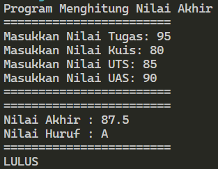
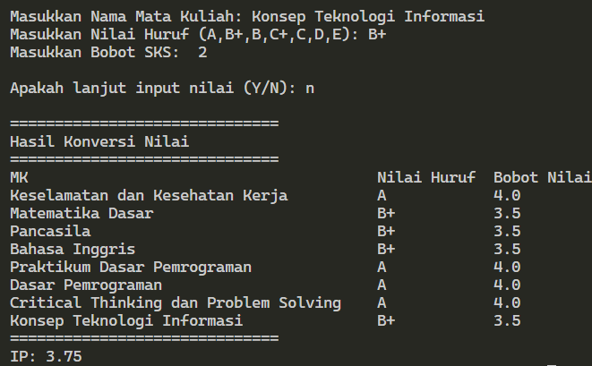
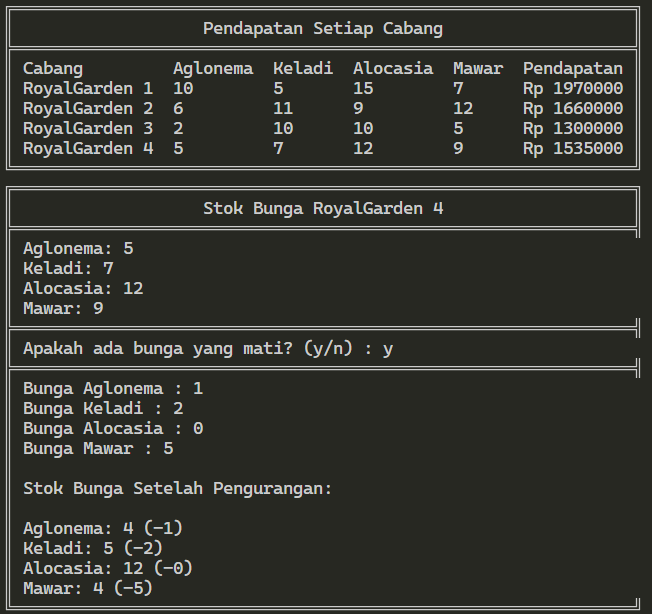

# <p align="center">JOBSHEET I - KONSEP DASAR PEMROGRAMAN</p>

<br><br>

<p align="center">
    
</p>

<br><br>

<p align="center">
    Nama : Ahmad Naufal Waskito Aji <br>
    NIM : 2341720080 <br>
    Kelas : TI-1B <br>
    Prodi : D4 Teknik Informatika
</p>

***

## Praktikum Pemilihan
### **1.1 Kode Percobaan**
```java
import java.util.Scanner;

public class Pemilihan {

    public static void main(String[] args) {
        Scanner sc04 = new Scanner(System.in);
        System.out.println("Program Menghitung Nilai Akhir");
        
        System.out.println("========================");
        
        System.out.print("Masukkan Nilai Tugas: ");
        double NilaiTugas = sc04.nextDouble();
        System.out.print("Masukkan Nilai Kuis: ");
        double NilaiKuis = sc04.nextDouble();
        System.out.print("Masukkan Nilai UTS: ");
        double NilaiUTS = sc04.nextDouble();
        System.out.print("Masukkan Nilai UAS: ");
        double NilaiUAS = sc04.nextDouble();

        System.out.println("========================");
        System.out.println("========================");

        if (NilaiTugas < 0 || NilaiTugas > 100) {
            System.out.println("Nilai Tidak Valid");
        } else if (NilaiKuis < 0 || NilaiKuis > 100) {
            System.out.println("Nilai Tidak Valid");
        } else if (NilaiUTS < 0 || NilaiUTS > 100) {
            System.out.println("Nilai Tidak Valid");
        } else if (NilaiUAS < 0 || NilaiUAS > 100) {
            System.out.println("Nilai Tidak Valid");
        } else {
            double NilaiAkhir = NilaiTugas * 0.2 + NilaiKuis * 0.2 + NilaiUTS * 0.3 + NilaiUAS * 0.3;
            System.out.println("Nilai Akhir : " + NilaiAkhir);
    
            String NilaiHuruf;
            if (80 < NilaiAkhir && NilaiAkhir <= 100) {
                NilaiHuruf = "A";
            } else if (73 < NilaiAkhir && NilaiAkhir <= 80) {
                NilaiHuruf = "B+";
            } else if (65 < NilaiAkhir && NilaiAkhir <= 73) {
                NilaiHuruf = "B";
            } else if (60 < NilaiAkhir && NilaiAkhir <= 65) {
                NilaiHuruf = "C+";
            } else if (50 < NilaiAkhir && NilaiAkhir <= 60) {
                NilaiHuruf = "C";
            } else if (39 < NilaiAkhir && NilaiAkhir <= 50) {
                NilaiHuruf = "D";
            } else {
                NilaiHuruf = "E";
            }
            System.out.println("Nilai Huruf : " + NilaiHuruf);
    
            System.out.println("========================");
    
            String Keterangan;
            if (50 < NilaiAkhir && NilaiAkhir <= 100) {
                Keterangan = "LULUS";
            } else {
                Keterangan = "TIDAK LULUS";
            }
            System.out.println(Keterangan);
            
            sc04.close();
        }
    }
}
```

### **1.2 Hasil Percobaan**


``Jika nilai yang dimasukkan diluar ketentuan``


## Praktikum Perulangan
### **2.1 Kode Percobaan**
```java
import java.util.Scanner;

public class Perulangan {

    public static void main(String[] args) {
        Scanner sc04 = new Scanner(System.in);

        System.out.print("Masukkan NIM: ");
        String NIM = sc04.next();

        int n = Integer.parseInt(NIM.substring(NIM.length() - 2));

        if (n < 10) {
            n += 10;
        }

        for (int i = 1; i <= n; i++) {
            if (i == 6 || i == 10) {
                continue;
            }

            if (i % 2 == 0) {
                System.out.print(i + " ");
            } else {
                System.out.print("* ");
            }
        }

        sc04.close();

    }
}
```

### **2.2 Hasil Percobaan**
``Jika n lebih besar daripada 10``


``Jika n lebih kecil daripada 10``


## Praktikum Array
### **3.1 Kode Percobaan**
```java
import java.util.Scanner;
import java.text.DecimalFormat;

public class Array {
    public static void main(String[] args) {
        DecimalFormat df = new DecimalFormat("#.##");

        String[][] MataKuliah = new String[8][3];

        Scanner sc04 = new Scanner(System.in);

        String NamaMatkul, NilaiHuruf;
        int BobotSKS, JumlahSKS = 0;
        Double NilaiAngka, IP = 0.0;
        String konfirmasi;

        System.out.println("==============================");
        System.out.println("Program Menghitung IP Semester");
        System.out.println("==============================");

        do {

            System.out.print("Masukkan Nama Mata Kuliah: ");
            NamaMatkul = sc04.nextLine();
            System.out.print("Masukkan Nilai Huruf (A,B+,B,C+,C,D,E): ");
            NilaiHuruf = sc04.nextLine();
            System.out.print("Masukkan Bobot SKS:  ");
            BobotSKS = sc04.nextInt();

            System.out.println();

            for(int i=0; i<MataKuliah.length; i++) {
                if(MataKuliah[i][0] == null) {
                    MataKuliah[i][0] = NamaMatkul;
                    MataKuliah[i][1] = NilaiHuruf;
                    MataKuliah[i][2] = String.valueOf(BobotSKS);
                    break;
                }
            }

            System.out.print("Apakah lanjut input nilai (Y/N): ");
            konfirmasi = sc04.next();
            sc04.nextLine();

            System.out.println();

        } while (konfirmasi.equalsIgnoreCase("y"));
            
        for(int i=0; i<MataKuliah.length; i++) {
            if(MataKuliah[i][0] != null) {
                JumlahSKS += Integer.parseInt(MataKuliah[i][2]);
            } else {
                break;
            }
        }

        for(int i=0; i<MataKuliah.length; i++) {
            if(MataKuliah[i][0] != null) {
                NilaiAngka = MataKuliah[i][1].equalsIgnoreCase("A") ? 4.0
                : MataKuliah[i][1].equalsIgnoreCase("B+") ? 3.5
                : MataKuliah[i][1].equalsIgnoreCase("B") ? 3.0
                : MataKuliah[i][1].equalsIgnoreCase("C+") ? 2.5
                : MataKuliah[i][1].equalsIgnoreCase("C") ? 2.0
                : MataKuliah[i][1].equalsIgnoreCase("D") ? 1.0
                : 0.0;

                IP += ((NilaiAngka * Integer.parseInt(MataKuliah[i][2])) / JumlahSKS);
            }
        }

        System.out.println("==============================");
        System.out.println("Hasil Konversi Nilai");
        System.out.println("==============================");

        System.out.println(String.format("%-40s %-12s %-12s",
        "MK",
        "Nilai Huruf",
        "Bobot Nilai"
        ));

        for(int i=0; i<MataKuliah.length; i++) {

            if(MataKuliah[i][0] != null) {

                NilaiAngka = MataKuliah[i][1].equalsIgnoreCase("A") ? 4.0
                : MataKuliah[i][1].equalsIgnoreCase("B+") ? 3.5
                : MataKuliah[i][1].equalsIgnoreCase("B") ? 3.0
                : MataKuliah[i][1].equalsIgnoreCase("C+") ? 2.5
                : MataKuliah[i][1].equalsIgnoreCase("C") ? 2.0
                : MataKuliah[i][1].equalsIgnoreCase("D") ? 1.0
                : 0.0;
    
                System.out.println(String.format("%-40s %-12s %-12s",
                MataKuliah[i][0],
                MataKuliah[i][1],
                NilaiAngka
                ));

            }

        }

        System.out.println("==============================");
        System.out.println("IP: " + (df.format(IP)));

        sc04.close();
    }
}
```

### **3.2 Hasil Percobaan**




## Praktikum Fungsi
### **4.1 Kode Percobaan**
```java
public class Fungsi {

    static int[][] RoyalGarden = new int[4][4];
    static String[] jenisBunga = {"Aglonema", "Keladi", "Alocasia", "Mawar"};
    public static void main(String[] args) {

        RoyalGarden[0][0] = 10;
        RoyalGarden[0][1] = 5;
        RoyalGarden[0][2] = 15;
        RoyalGarden[0][3] = 7;

        RoyalGarden[1][0] = 6;
        RoyalGarden[1][1] = 11;
        RoyalGarden[1][2] = 9;
        RoyalGarden[1][3] = 12;

        RoyalGarden[2][0] = 2;
        RoyalGarden[2][1] = 10;
        RoyalGarden[2][2] = 10;
        RoyalGarden[2][3] = 5;

        RoyalGarden[3][0] = 5;
        RoyalGarden[3][1] = 7;
        RoyalGarden[3][2] = 12;
        RoyalGarden[3][3] = 9;

        Pendapatan();
        StokBungaRG4();

    }

    private static void Pendapatan() {

        for(int i=0;i<RoyalGarden.length;i++) {

            int pendapatan = 0;
            pendapatan += RoyalGarden[i][0] * 75000;
            pendapatan += RoyalGarden[i][1] * 50000;
            pendapatan += RoyalGarden[i][2] * 60000;
            pendapatan += RoyalGarden[i][3] * 10000;
            System.out.println("Pendapatan RoyalGarden " + (i+1) + ": " + pendapatan);

        }

    }

    private static void StokBungaRG4() {

        System.out.println("\nJumlah Stok Bunga di RoyalGarden 4:");
        for (int j = 0; j < RoyalGarden[3].length; j++) {
            System.out.println(jenisBunga[j] + ": " + RoyalGarden[3][j]);
        }

        RoyalGarden[3][0] -= 1;
        RoyalGarden[3][1] -= 2;
        RoyalGarden[3][2] -= 0;
        RoyalGarden[3][3] -= 5; 

        System.out.println("\nJumlah Stok Bunga di RoyalGarden 4 setelah bunga mati:");
        for (int j = 0; j < RoyalGarden[3].length; j++) {
            System.out.println(jenisBunga[j] + ": " + RoyalGarden[3][j]);
        }        

    }

}

```

### **4.2 Hasil Percobaan**
```Menampilkan pendapatan setiap cabang jika semua bunga habis terjual```



```Menampilkan jumlah stock pada RoyalGarden 4```


## Tugas

### 5.1 Tugas 1
#### **5.1.1 Pertanyaan**
Susun program untuk membuat dua buah array berikut isinya sebagai berikut. Array pertama adalah array satu dimensi char KODE[10], berisi kode plat mobil. Array kedua, array dua dimensi char KOTA[10][12] berisi nama kota yang berpasangan dengan kode plat mobil. Ilustrasi tampilan array tersebut adalah sebagai berikut :

#### **5.1.2 Kode Percobaan**
```java
import java.util.Scanner;

public class Tugas1 {
    public static void main(String[] args) {

        Scanner sc04 = new Scanner(System.in);

        char[] KODE = {'A', 'B', 'D', 'E', 'F', 'G', 'H', 'L', 'N', 'T'};

        char[][] KOTA = {
                {'B', 'A', 'N', 'T', 'E', 'N'},
                {'J', 'A', 'K', 'A', 'R', 'T', 'A'},
                {'B', 'A', 'N', 'D', 'U', 'N', 'G'},
                {'C', 'I', 'R', 'E', 'B', 'O', 'N'},
                {'B', 'O', 'G', 'O', 'R'},
                {'P', 'E', 'K', 'A', 'L', 'O', 'N', 'G', 'A', 'N'},
                {'S', 'E', 'M', 'A', 'R', 'A', 'N', 'G'},
                {'S', 'U', 'R', 'A', 'B', 'A', 'Y', 'A'},
                {'M', 'A', 'L', 'A', 'N', 'G'},
                {'T', 'E', 'G', 'A', 'L'}
        };

        System.out.print("Masukkan kode plat nomor : ");
        char plat = sc04.next().toUpperCase().charAt(0);

        for(int i=0; i<KODE.length; i++) {
            if(KODE[i] == plat) {
                for(int j=0; j<KOTA[i].length; j++) {
                    System.out.print(KOTA[i][j]);
                }
            }
        }

        sc04.close();

    }
}
```

#### **5.1.3 Hasil Percobaan**


Ketika pengguna memberikan input kode plat nomor maka program akan mengeluarkan 
nama kota dari kode plat nomor tersebut.

### 5.2 Tugas 2
#### **5.2.1 Pertanyaan**
Buat program untuk menghitung rumus kecepatan, jarak, dan waktu
Berikut adalah persamaan untuk menghitung rumus tersebut :


Program yang dibuat memiliki fungsi sebagai berikut:
a. Menu (Untuk memilih rumus yang akan dihitung (kecepatan/jarak/waktu))
b. Menghitung hasil perhitungan Kecepatan
c. Menghitung hasil perhitungan Jarak
d. Menghitung hasil perhitungan Waktu
Panggil fungsi-fungsi tersebut pada fungsi main!

#### **5.2.2 Kode Percobaan**
```java
import java.util.Scanner;

public class Tugas2 {
    
    static Scanner sc04 = new Scanner(System.in);

    static double s;
    static double t;
    static double v;
    public static void main(String[] args) {
        MenuUtama();
    }

    private static void MenuUtama() {

        System.out.println("1. Hitung Kecepatan");
        System.out.println("2. Hitung Jarak");
        System.out.println("3. Hitung Waktu");
        System.out.print("Pilihan: ");
        
        int pilihan = sc04.nextInt();

        switch (pilihan) {
            case 1:
                System.out.print("Masukkan Jarak: ");
                s = sc04.nextInt();
                System.out.print("Masukkan Waktu: ");
                t = sc04.nextInt();
                System.out.println(HitungKecepatan(s, t));
                break;

            case 2:
                System.out.print("Masukkan Kecepatan: ");
                v = sc04.nextInt();
                System.out.print("Masukkan Waktu: ");
                t = sc04.nextInt();
                System.out.println(HitungJarak(v, t));
                break;

            case 3:
                System.out.print("Masukkan Jarak: ");
                s = sc04.nextInt();
                System.out.print("Masukkan Kecepatan: ");
                v = sc04.nextInt();
                System.out.println(HitungWaktu(s, v));
                break;

            default:
                System.out.println("Invalid choice!");;
        }
    }

    private static double HitungKecepatan(double s, double t) {
        return s/t;
    }

    private static double HitungJarak(double v, double t) {
        return v*t;
    }

    private static double HitungWaktu(double s, double v) {
        return s/v;
    }

}
```

#### **5.2.3 Hasil Percobaan**
``Menghitung Kecepatan``


``Menghitung Jarak``


``Menghitung Waktu``

