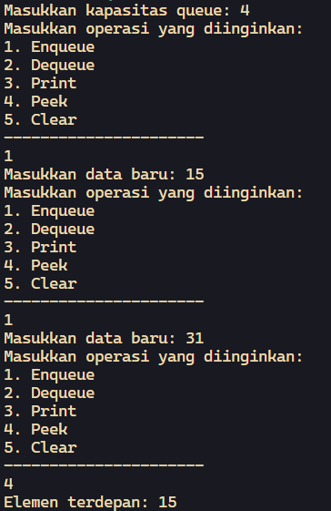
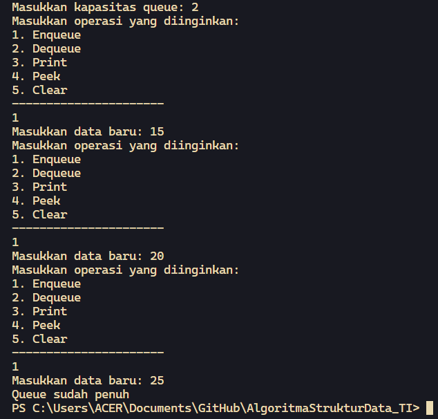
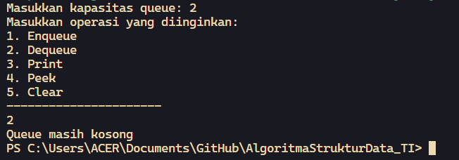
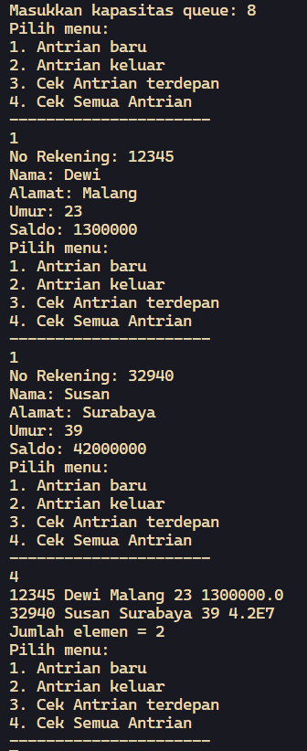
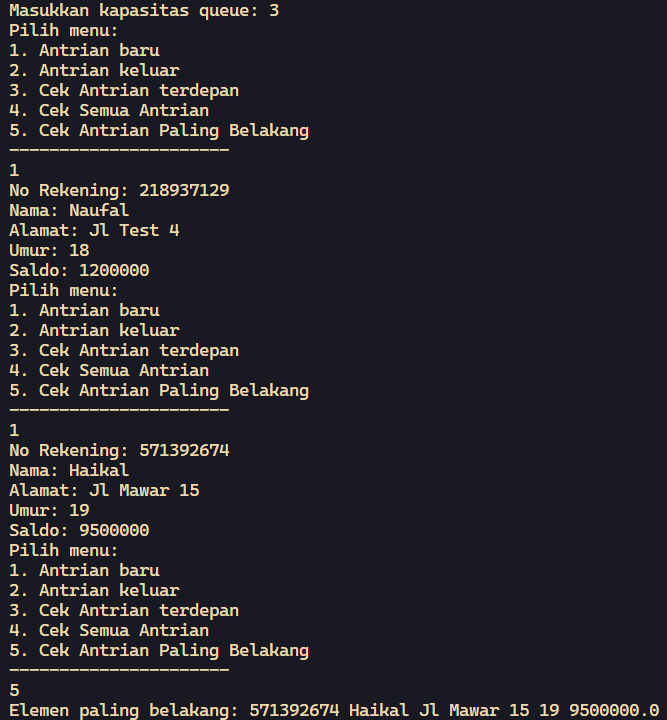

# <p align="center">JOBSHEET X - QUEUE</p>

<br><br>

<p align="center">
    
</p>

<br><br>

<p align="center">
    Nama : Ahmad Naufal Waskito Aji <br>
    NIM : 2341720080 <br>
    Kelas : TI-1B <br>
    Prodi : D4 Teknik Informatika
</p>

***

## Praktikum 1
### **1.1 Kode Percobaan**
``Queue.java``
```java
public class Queue {
    int[] data;
    int front;
    int rear;
    int size;
    int max;

    public Queue(int n) {
        max = n;
        data = new int[max];
        size = 0;
        front = rear = -1;
    }

    public boolean IsEmpty() {
        if (size == 0) {
            return true;
        } else {
            return false;
        }
    }

    public boolean IsFull() {
        if (size == max) {
            return true;
        } else {
            return false;
        }
    }

    public void peek() {
        if (!IsEmpty()) {
            System.out.println("Elemen terdepan: " + data[front]);
        } else {
            System.out.println("Queue masih kosong");
        }
    }

    public void print() {
        if (IsEmpty()) {
            System.out.println("Queue masih kosong");
        } else {
            int i = front;
            while (i != rear) {
                System.out.println(data[i] + " ");
                i = (i + 1) % max;
            }
            System.out.println(data[i] + " ");
            System.out.println("Jumlah elemen = " + size);
        }
    }

    public void clear() {
        if (!IsEmpty()) {
            front = rear = -1;
            size = 0;
            System.out.println("Queue berhasil dikosongkan");
        } else {
            System.out.println("Queue masih kosong");
        }
    }

    public void Enqueue(int dt) {
        if (IsFull()) {
            System.out.println("Queue sudah penuh");
        } else {
            if (IsEmpty()) {
                front = rear = 0;
            } else {
                if (rear == max - 1) {
                    rear = 0;
                } else {
                    rear++;
                }
            }
            data[rear] = dt;
            size++;
        }
    }

    public int Dequeue() {
        int dt = 0;
        if (IsEmpty()) {
            System.out.println("Queue masih kosong");
        } else {
            dt = data[front];
            size--;
            if (IsEmpty()) {
                front = rear = -1;
            } else {
                if (front == max - 1) {
                    front = 0;
                } else {
                    front++;
                }
            }
        }
        return dt;
    }


}
```

``QueueMain.java``
```java
import java.util.Scanner;

public class QueueMain {
    public static void menu() {
        System.out.println("Masukkan operasi yang diinginkan:");
        System.out.println("1. Enqueue");
        System.out.println("2. Dequeue");
        System.out.println("3. Print");
        System.out.println("4. Peek");
        System.out.println("5. Clear");
        System.out.println("----------------------");
    }

    public static void main(String[] args) {
        Scanner sc = new Scanner(System.in);

        System.out.print("Masukkan kapasitas queue: ");
        int n = sc.nextInt();

        Queue Q = new Queue(n);
        int pilih;

        do {
            menu();
            pilih = sc.nextInt();
            switch (pilih) {
                case 1:
                    System.out.print("Masukkan data baru: ");
                    int dataMasuk = sc.nextInt();
                    Q.Enqueue(dataMasuk);
                    break;

                case 2:
                    int dataKeluar = Q.Dequeue();
                    if (dataKeluar != 0) {
                        System.out.println("Data yang dikeluarkan: " + dataKeluar);
                        break;
                    }

                case 3:
                    Q.print();
                    break;

                case 4:
                    Q.peek();
                    break;

                case 5:
                    Q.clear();
                    break;
            
                default:
                    break;
            }
        } while (pilih == 1 || pilih == 2 || pilih == 3 || pilih == 4 || pilih == 5);
    }
}
```

### **1.2 Verifikasi Hasil Percobaan**



### **1.3 Pertanyaan**
1.  Pada konstruktor, mengapa nilai awal atribut front dan rear bernilai -1, sementara atribut size bernilai 0? <br>
    **Jawaban :**
    ``
    Front dan rear bernilai -1 karena tidak menunjuk ke data manapun sedangkan size bernilai 0 karena array masih kosong.
    ``

2. Pada method Enqueue, jelaskan maksud dan kegunaan dari potongan kode berikut! <br>
    ```java
    if (rear == max - 1) {
        rear = 0;
    }
    ```
    **Jawaban :**
    ``
    Ketika dimasukkan data baru, maka data tersebut akan menempati posisi indeks ke 0, artinya posisi REAR = 0.
    ``

3. Pada method Dequeue, jelaskan maksud dan kegunaan dari potongan kode berikut! <br>
    ```java
    if (rear == max - 1) {
        rear = 0;
    }
    ```
    **Jawaban :**
    ``
    Ketika dilakukan pengambilan data, maka posisi FRONT akan bergeser ke indeks ke-0
    ``

4.  Pada method print, mengapa pada proses perulangan variabel i tidak dimulai dari 0 (int i=0), melainkan int i=front? <br>
    **Jawaban :**
    ``
    Karena looping tidak selalu mulai dari indeks ke-0, front tidak selalu berada di indeks ke 0.
    ``

5. Perhatikan kembali method print, jelaskan maksud dari potongan kode berikut! <br>
    ```java
    i = (i + 1) % max;
    ```
    **Jawaban :**
    ``
    Operasi tersebut memperbarui variabel i untuk mengindeks elemen-elemen dalam array antrian. Setiap kali elemen dicetak, i akan bergeser ke elemen berikutnya, dan jika mencapai batas maksimum, akan kembali ke awal antrian, sehingga semua elemen dalam antrian dicetak dalam urutan yang benar.
    ``

6. Tunjukkan potongan kode program yang merupakan queue overflow! <br>
    **Jawaban :**
    ```java
        if (IsFull()) {
            System.out.println("Queue sudah penuh");
        }
    ```

7. Pada saat terjadi queue overflow dan queue underflow, program tersebut tetap dapat berjalan dan hanya menampilkan teks informasi. Lakukan modifikasi program sehingga pada saat terjadi queue overflow dan queue underflow, program dihentikan! <br>
    **Jawaban :**
    ``Queue Overflow``
    ```java
        public void Enqueue(int dt) {
            if (IsFull()) {
                System.out.println("Queue sudah penuh");
                System.exit(0);
            } else {
                if (IsEmpty()) {
                    front = rear = 0;
                } else {
                    if (rear == max - 1) {
                        rear = 0;
                    } else {
                        rear++;
                    }
                }
                data[rear] = dt;
                size++;
            }
        }
    ```
    

    ``Queue Underflow``
    ```java
        public int Dequeue() {
            int dt = 0;
            if (IsEmpty()) {
                System.out.println("Queue masih kosong");
                System.exit(0);
            } else {
                dt = data[front];
                size--;
                if (IsEmpty()) {
                    front = rear = -1;
                } else {
                    if (front == max - 1) {
                        front = 0;
                    } else {
                        front++;
                    }
                }
            }
            return dt;
        }
    ```
    


## Praktikum 2
### **2.1 Kode Percobaan**
``Nasabah.java``
```java
    public class Nasabah {
        String norek, nama, alamat;
        int umur;
        double saldo;
        
        Nasabah(String norek, String nama, String alamat, int umur, double saldo) {
            this.norek = norek;
            this.nama = nama;
            this.alamat = alamat;
            this.umur = umur;
            this.saldo = saldo;
        }

        Nasabah[] data;
        int front;
        int rear;
        int size;
        int max;

        public Nasabah(int n) {
            max = n;
            data = new Nasabah[max];
            size = 0;
            front = rear = -1;
        }

        public boolean IsEmpty() {
            if (size == 0) {
                return true;
            } else {
                return false;
            }
        }

        public boolean IsFull() {
            if (size == max) {
                return true;
            } else {
                return false;
            }
        }

        public void peek() {
            if (!IsEmpty()) {
                System.out.println("Elemen terdepan: " + data[front].norek + " " + data[front].nama
                        + " " + data[front].alamat + " " + data[front].umur + " " + data[front].saldo);
            } else {
                System.out.println("Queue masih kosong");
            }
        }

        public void print() {
            if (IsEmpty()) {
                System.out.println("Queue masih kosong");
            } else {
                int i = front;
                while (i != rear) {
                    System.out.println(data[front].norek + " " + data[front].nama
                    + " " + data[front].alamat + " " + data[front].umur + " " + data[front].saldo);
                    i = (i + 1) % max;
                }
                System.out.println(data[i].norek + " " + data[i].nama
                + " " + data[i].alamat + " " + data[i].umur + " " + data[i].saldo);
                System.out.println("Jumlah elemen = " + size);
            }
        }

        public void clear() {
            if (!IsEmpty()) {
                front = rear = -1;
                size = 0;
                System.out.println("Queue berhasil dikosongkan");
            } else {
                System.out.println("Queue masih kosong");
            }
        }

        public void Enqueue(Nasabah dt) {
            if (IsFull()) {
                System.out.println("Queue sudah penuh");
            } else {
                if (IsEmpty()) {
                    front = rear = 0;
                } else {
                    if (rear == max - 1) {
                        rear = 0;
                    } else {
                        rear++;
                    }
                }
                data[rear] = dt;
                size++;
            }
        }

        public Nasabah Dequeue() {
            Nasabah dt = new Nasabah();
            if (IsEmpty()) {
                System.out.println("Queue masih kosong");
            } else {
                dt = data[front];
                size--;
                if (IsEmpty()) {
                    front = rear = -1;
                } else {
                    if (front == max - 1) {
                        front = 0;
                    } else {
                        front++;
                    }
                }
            }
            return dt;
        }

        Nasabah() {

        }

    }
```

``Main.java``
```java
    import java.util.Scanner;

    public class QueueMain {

        public static void menu() {
            System.out.println("Pilih menu:");
            System.out.println("1. Antrian baru");
            System.out.println("2. Antrian keluar");
            System.out.println("3. Cek Antrian terdepan");
            System.out.println("4. Cek Semua Antrian");
            System.out.println("----------------------");
        }
        public static void main(String[] args) {
            Scanner sc = new Scanner(System.in);

            System.out.print("Masukkan kapasitas queue: ");
            int jumlah = sc.nextInt();

            Nasabah antri = new Nasabah(jumlah);
            int pilih;

            do {
                menu();
                pilih = sc.nextInt();
                switch (pilih) {
                    case 1:
                        System.out.print("No Rekening: ");
                        sc.nextLine();
                        String norek = sc.nextLine();
                        System.out.print("Nama: ");
                        String nama = sc.nextLine();
                        System.out.print("Alamat: ");
                        String alamat = sc.nextLine();
                        System.out.print("Umur: ");
                        int umur = sc.nextInt();
                        System.out.print("Saldo: ");
                        double saldo = sc.nextDouble();
                        Nasabah nb = new Nasabah(norek, nama, alamat, umur, saldo);
                        sc.nextLine();
                        antri.Enqueue(nb);
                        break;

                    case 2:
                        Nasabah data = antri.Dequeue();
                        if (!"".equals(data.norek) && !"".equals(data.nama) && !"".equals(data.alamat)
                                && data.umur != 0 && data.saldo != 0) {
                            System.out.println("Antrian yang keluar: " + data.norek + " " + data.nama + " "
                                    + data.alamat + " " + data.umur + " " + data.saldo);
                            break;
                        }

                    case 3:
                        antri.peek();
                        break;

                    case 4:
                        antri.print();
                        break;
                
                    default:
                        break;
                }
            } while (pilih == 1 || pilih == 2 || pilih == 3 || pilih == 4);
        } 
    }
```

### **2.2 Verifikasi Hasil Percobaan**



### **2.3 Pertanyaan**
1. Pada class QueueMain, jelaskan fungsi IF pada potongan kode program berikut! <br>
    ```java
        if (!"".equals(data.norek) && !"".equals(data.nama) && !"".equals(data.alamat)
                && data.umur != 0 && data.saldo != 0) {
            System.out.println("Antrian yang keluar: " + data.norek + " " + data.nama + " "
                    + data.alamat + " " + data.umur + " " + data.saldo);
            break;
        }
    ```
    **Jawaban :**
    ``
    Potongan kode tersebut bertujuan untuk memeriksa apakah data yang diambil dari antrian tidak kosong dan memiliki nilai yang valid. Operator !"".equals(data.norek) untuk memastikan bahwa atribut norek tidak kosong. Kemudian, dilakukan pula pengecekan apakah atribut umur dan saldo tidak sama dengan 0.
    ``

2. Lakukan modifikasi program dengan menambahkan method baru bernama peekRear pada class Queue yang digunakan untuk mengecek antrian yang berada di posisi belakang! Tambahkan pula daftar menu 5. Cek Antrian paling belakang pada class QueueMain sehingga method peekRear dapat dipanggil! <br>
    **Jawaban :**
    ```java
        public void peekRear() {
            if (!IsEmpty()) {
                System.out.println("Elemen paling belakang: " + data[rear].norek + " " + data[rear].nama
                        + " " + data[rear].alamat + " " + data[rear].umur + " " + data[rear].saldo);
            } else {
                System.out.println("Queue masih kosong");
            }
        }
    ```
    


## Tugas

``Pembeli.java``
```java
package Tugas;

public class Pembeli {
    String nama;
    int noHP;
    
    Pembeli(String nama, int noHP) {
        this.nama = nama;
        this.noHP = noHP;
    }

    Pembeli[] data;
    int front;
    int rear;
    int size;
    int max;

}
```

``Queue.java``
```java
package Tugas;

public class Queue {

    Pembeli[] data;
    int front;
    int rear;
    int size;
    int max;

    public Queue(int n) {
        max = n;
        data = new Pembeli[max];
        size = 0;
        front = rear = -1;
    }

    public boolean IsEmpty() {
        if (size == 0) {
            return true;
        } else {
            return false;
        }
    }

    public boolean IsFull() {
        if (size == max) {
            return true;
        } else {
            return false;
        }
    }

    public void peek() {
        if (!IsEmpty()) {
            System.out.println("Elemen terdepan: " + data[front].nama + data[front].noHP);
        } else {
            System.out.println("Queue masih kosong");
        }
    }

    public void print() {
        if (IsEmpty()) {
            System.out.println("Queue masih kosong");
        } else {
            int i = front;
            while (i != rear) {
                System.out.println(data[front].nama + data[front].noHP);
                i = (i + 1) % max;
            }
            System.out.println("Elemen terdepan: " + data[front].nama + data[front].noHP);
            System.out.println("Jumlah elemen = " + size);
        }
    }

    public void clear() {
        if (!IsEmpty()) {
            front = rear = -1;
            size = 0;
            System.out.println("Queue berhasil dikosongkan");
        } else {
            System.out.println("Queue masih kosong");
        }
    }

    public void Enqueue(Pembeli antri) {
        if (IsFull()) {
            System.out.println("Queue sudah penuh");
        } else {
            if (IsEmpty()) {
                front = rear = 0;
            } else {
                if (rear == max - 1) {
                    rear = 0;
                } else {
                    rear++;
                }
            }
            data[rear] = antri;
            size++;
        }
    }

    public Pembeli Dequeue() {
        Pembeli dt = null;
        if (IsEmpty()) {
            System.out.println("Queue masih kosong");
        } else {
            dt = data[front];
            size--;
            if (IsEmpty()) {
                front = rear = -1;
            } else {
                if (front == max - 1) {
                    front = 0;
                } else {
                    front++;
                }
            }
        }
        return dt;
    }

    public void peekRear() {
        if (!IsEmpty()) {
            System.out.println("Elemen paling belakang: " + data[rear].nama + data[rear].noHP);
        } else {
            System.out.println("Queue masih kosong");
        }
    }

    public void peekPosition(String nama) {
        if (IsEmpty()) {
            System.out.println("Queue masih kosong");
        } else {
            int currentPosition = front;
            int position = 0;
            boolean found = false;
            while (currentPosition != rear) {
                if (data[currentPosition].nama.equals(nama)) {
                    found = true;
                    break;
                }
                currentPosition = (currentPosition + 1) % max;
                position++;
            }
            if (data[currentPosition].nama.equals(nama)) {
                found = true;
            }
            if (found) {
                System.out.println("Posisi " + nama + " dalam antrian: " + position);
            } else {
                System.out.println("Nama tidak ditemukan dalam antrian");
            }
        }
    }

    public void daftarPembeli() {
        if (IsEmpty()) {
            System.out.println("Queue masih kosong");
        } else {
            int i = front;
            while (i != rear) {
                System.out.println(data[front].nama + data[front].noHP);
                i = (i + 1) % max;
            }
            System.out.println("Elemen terdepan: " + data[front].nama + data[front].noHP);
            System.out.println("Jumlah elemen = " + size);
        }
    }
    
}
```

``Queue.main``
```java
package Tugas;

import java.util.Scanner;

public class QueueMain {

    public static void menu() {
        System.out.println("Pilih menu:");
        System.out.println("1. Antrian baru");
        System.out.println("2. Antrian keluar");
        System.out.println("3. Cek Antrian terdepan");
        System.out.println("4. Cek Semua Antrian");
        System.out.println("5. Cek Antrian Paling Belakang");
        System.out.println("6. Cek Antrian Berdasarkan Nama");

        System.out.println("----------------------");
    }
    public static void main(String[] args) {
        Scanner sc = new Scanner(System.in);

        System.out.print("Masukkan kapasitas queue: ");
        int jumlah = sc.nextInt();

        Queue antri = new Queue(jumlah);
        int pilih;

        do {
            menu();
            pilih = sc.nextInt();
            switch (pilih) {
                case 1:
                    System.out.print("Nama: ");
                    sc.nextLine();
                    String nama = sc.nextLine();
                    System.out.print("No HP: ");
                    int noHP = sc.nextInt();
                    Pembeli nb = new Pembeli(nama, noHP);
                    sc.nextLine();
                    antri.Enqueue(nb);
                    break;

                case 2:
                    Pembeli data = antri.Dequeue();
                    if (!"".equals(data.nama) && data.noHP != 0) {
                        System.out.println("Antrian yang keluar: " + data.nama + " " + data.noHP);
                        break;
                    }

                case 3:
                    antri.peek();
                    break;

                case 4:
                    antri.print();
                    break;

                case 5:
                    antri.peekRear();
                    break;

                case 6:
                    sc.nextLine();
                    System.out.print("Nama: ");
                    String key = sc.nextLine();
                    antri.peekPosition(key);
                    break;
            
                default:
                    break;
            }
        } while (pilih == 1 || pilih == 2 || pilih == 3 || pilih == 4 || pilih == 5 | pilih == 6);
    } 
}
```


