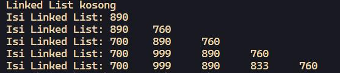
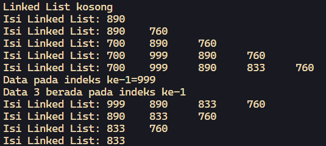
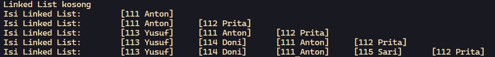
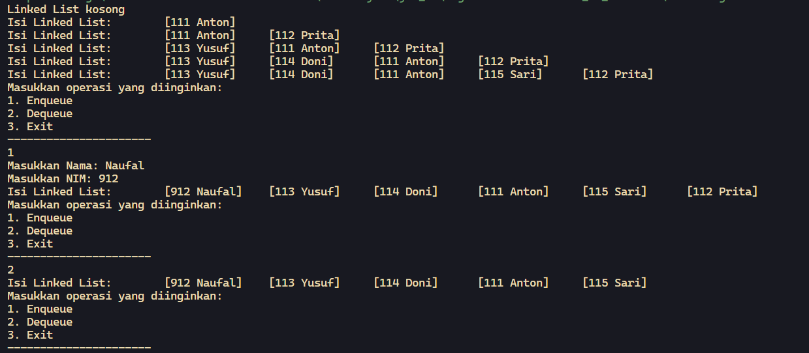

# <p align="center">JOBSHEET IX - LINKED LIST</p>

<br><br>

<p align="center">
    
</p>

<br><br>

<p align="center">
    Nama : Ahmad Naufal Waskito Aji <br>
    NIM : 2341720080 <br>
    Kelas : TI-1B <br>
    Prodi : D4 Teknik Informatika
</p>

***

## Percobaan 1: Pembuatan Single Linked List
### **1.1 Kode Percobaan**
``SingleLinkedList.java``
```java
public class SingleLinkedList {
    Node head, tail;

    boolean isEmpty() {
        return head == null;
    }

    void print(){
        if(!isEmpty()) {
            Node tmp = head;
            System.out.print("Isi Linked List: ");
            while (tmp != null) {
                System.out.print(tmp.data + "\t");
                tmp = tmp.next;
            }
            System.out.println("");
        } else {
            System.out.println("Linked List kosong");
        }
    }

    void addFirst(int input) {
        Node ndInput = new Node(input, null);
        if(isEmpty()){
            head = ndInput;
            tail = ndInput;
        } else {
            ndInput.next = head;
            head = ndInput;
        }
    }

    void addLast(int input) {
        Node ndInput = new Node(input, null);
        if(isEmpty()){
            head = ndInput;
            tail = ndInput;
        } else {
            tail.next = ndInput;
            tail = ndInput;
        }
    }    

    void insertAfter(int key, int input){
        Node ndInput = new Node(input, null);
        Node temp = head;
        do{
            if(temp.data == key){
                ndInput.next = temp.next;
                temp.next = ndInput;
                if(ndInput.next == null){
                    tail = ndInput;
                    
                }
                break;
            }
            temp = temp.next;
        } while(temp != null);
    }

    void insertAt(int index, int input){
        Node ndInput = new Node(input, null);
        if(index < 0){
            System.out.println("perbaiki logikanya!"
                    + "kalau indeksnya -1 bagaimana???");
        } else if (index == 0) {
            addFirst(input);
        } else {
            Node temp = head;
            for(int i=0; i<index-1; i++){
                temp = temp.next;
            }
            temp.next = new Node(input, temp.next);
            if(temp.next.next==null){
                tail=temp.next;
            }
        }
    }
}
```

``SLLMain.java``
```java
public class SLLMain {
    public static void main(String[] args) {
        SingleLinkedList singLL = new SingleLinkedList();
        singLL.print();
        singLL.addFirst(890);
        singLL.print();
        singLL.addLast(760);
        singLL.print();
        singLL.addFirst(700);
        singLL.print();
        singLL.insertAfter(700, 999);
        singLL.print();
        singLL.insertAt(3, 833);
        singLL.print();
    }
}
```

### **1.2 Verifikasi Hasil Percobaan**



### **1.3 Pertanyaan**
1.  Mengapa hasil compile kode program di baris pertama menghasilkan “Linked List Kosong”? <br>
    **Jawaban :**
    ``
    isEmpty() memeriksa apakah head dari linked list bernilai null. Jika head adalah null, berarti linked list tidak memiliki elemen apa pun, dan metode ini akan mengembalikan true dan print() akan mencetak "Linked List kosong".
    ``

2. Jelaskan kegunaan variable temp secara umum pada setiap method! <br>
    **Jawaban :**
    ``
    Secara keseluruhan, temp berfungsi sebagai penunjuk sementara atau iterator yang memudahkan berbagai operasi pada linked list.
    ``

3. Perhatikan class SingleLinkedList, pada method insertAt Jelaskan kegunaan kode berikut  <br> 
    ```java
        if(temp.next.next==null) tail=temp.next;
    ```
    **Jawaban :**
    ``
    Kode tersebut digunakan untuk memperbarui penunjuk tail dari linked list ketika node baru yang disisipkan menjadi node terakhir dalam linked list, sehingga tail selalu menunjuk ke node terakhir yang sebenarnya.
    ``


## Percobaan 2: Memodifikasi Elemen pada Single Linked List
### **2.1 Kode Percobaan**
``SingleLinkedList.java``
```java
    int getData(int index){
        Node tmp = head;
        for(int i=0; i<index-1; i++){
            tmp = tmp.next;
        }
        return tmp.next.data;
    }

    int indexOf(int key){
        Node tmp = head;
        int index = 0;
        while (tmp != null && tmp.data != key) {
            tmp = tmp.next;
            index++;
        }
        if (tmp != null) {
            return 1;
        } else {
            return index;
        }
    }

    void removeFirst(){
        if(isEmpty()){
            System.out.println("Linked list masih kosong,"
                    + "tidak dapat dihapus");
        } else if (head == tail){
            head = tail = null;
        } else {
            head = head.next;
        }
    }

    void removeLast(){
        if(isEmpty()){
            System.out.println("Linked list masih kosong,"
                    + "tidak dapat dihapus");
        } else if (head == tail) {
            head = tail = null;
        } else {
            Node temp = head;
            while (temp.next != tail) {
                temp = temp.next;
            }
            temp.next = null;
            tail = temp;
        }
    }

    void remove(int key){
        if(isEmpty()){
            System.out.println("Linked list masih kosong,"
                    + "tidak dapat dihapus");
        } else {
            Node temp = head;
            while (temp!=null) {
                if(temp.data != key && temp==head) {
                    removeFirst();
                    break;
                } else if (temp.next.data == key) {
                    temp.next = temp.next.next;
                    if(temp.next == null) {
                        tail = temp;
                    }
                    break;
                }
                temp = temp.next;
            }
        }
    }

    public void removeAt(int index) {
        if (index == 0) {
            removeFirst();
        } else {
            Node temp = head;
            for (int i = 0; i < index - 1; i++){
                temp = temp.next;
            }
            temp.next = temp.next.next;
            if (temp.next == null) {
                tail = temp;
            }
        }
    }
```

``SLLMain.java``
```java
    public class SLLMain {
        public static void main(String[] args) {
            SingleLinkedList singLL = new SingleLinkedList();
            singLL.print();
            singLL.addFirst(890);
            singLL.print();
            singLL.addLast(760);
            singLL.print();
            singLL.addFirst(700);
            singLL.print();
            singLL.insertAfter(700, 999);
            singLL.print();
            singLL.insertAt(3, 833);
            singLL.print();

            System.out.println("Data pada indeks ke-1="+singLL.getData(1));
            System.out.println("Data 3 berada pada indeks ke-"+singLL.indexOf(760));

            singLL.remove(999);
            singLL.print();
            singLL.removeAt(0);
            singLL.print();
            singLL.removeFirst();
            singLL.print();
            singLL.removeLast();
            singLL.print();
        }
    }
```

### **2.2 Verifikasi Hasil Percobaan**



### **1.3 Pertanyaan**
1.  Mengapa digunakan keyword break pada fungsi remove? Jelaskan!”? <br>
    **Jawaban :**
    ``
    Break digunakan untuk keluar dari loop ketika node telah ditemukan dan dihapus.
    ``

2. Jelaskan kegunaan kode dibawah pada method remove <br>
    **Jawaban :**
    ``
    Kode tersebut digunakan untuk menghapus node yang memiliki nilai data yang sesuai dengan key dari linked list. Ini dilakukan dengan mengubah referensi next dari node saat ini untuk melewatkan node yang dihapus dan langsung menunjuk ke node setelahnya, sehingga node dengan data yang sama dengan key dihapus dari linked list.
    ``


## Tugas 1
**Implementasikan ilustrasi Linked List Berikut. Gunakan 4 macam penambahan data yang telah dipelajari sebelumnya untuk menginputkan data.**

### **Kode Percobaan**

**Node.java**
```java
    package Tugas;
    public class Node {
        String nama;
        int nim;
        Node next;

        Node(String nama, int nim, Node berikutnya) {
            this.nama = nama;
            this.nim = nim;
            this.next = berikutnya;
        }

    }
```

**SingleLinkedList.java**
```java
    package Tugas;
    public class SingleLinkedList {
        Node head, tail;

        boolean isEmpty() {
            return head == null;
        }

        void print(){
            if(!isEmpty()) {
                Node tmp = head;
                System.out.print("Isi Linked List: ");
                while (tmp != null) {
                    System.out.print("\t" + "[" + tmp.nim + " " + tmp.nama + "]");
                    tmp = tmp.next;
                }
                System.out.println("");
            } else {
                System.out.println("Linked List kosong");
            }
        }

        void addFirst(String nama, int nim) {
            Node ndInput = new Node(nama, nim, null);
            if(isEmpty()){
                head = ndInput;
                tail = ndInput;
            } else {
                ndInput.next = head;
                head = ndInput;
            }
        }

        void addLast(String nama, int nim) {
            Node ndInput = new Node(nama, nim, null);
            if(isEmpty()){
                head = ndInput;
                tail = ndInput;
            } else {
                tail.next = ndInput;
                tail = ndInput;
            }
        }    

        void insertAfter(int key, String nama, int nim){
            Node ndInput = new Node(nama, nim, null);
            Node temp = head;
            do{
                if(temp.nim == key){
                    ndInput.next = temp.next;
                    temp.next = ndInput;
                    if(ndInput.next == null){
                        tail = ndInput;
                        
                    }
                    break;
                }
                temp = temp.next;
            } while(temp != null);
        }

        void insertAt(int index, String nama, int nim){
            Node ndInput = new Node(nama , nim, null);
            if(index < 0){
                System.out.println("perbaiki logikanya!"
                        + "kalau indeksnya -1 bagaimana???");
            } else if (index == 0) {
                addFirst(nama, nim);
            } else {
                Node temp = head;
                for(int i=0; i<index-1; i++){
                    temp = temp.next;
                }
                temp.next = new Node(nama, nim, temp.next);
                if(temp.next.next==null){
                    tail=temp.next;
                }
            }
        } 
    }
```

**SLLMain.java**
```java
    package Tugas;
    public class SLLMain {
        public static void main(String[] args) {
            SingleLinkedList singLL = new SingleLinkedList();
            singLL.print();
            singLL.addFirst("Anton", 111);
            singLL.print();
            singLL.addLast("Prita", 112);
            singLL.print();
            singLL.addFirst("Yusuf", 113);
            singLL.print();
            singLL.insertAfter(113, "Doni", 114);
            singLL.print();
            singLL.insertAt(3, "Sari", 115);
            singLL.print();
        }
    }
```


### **Verifikasi Hasil Percobaan**



## Tugas 2

Buatlah implementasi program antrian layanan unit kemahasiswaan sesuai dengan kondisi yang ditunjukkan pada soal nomor 1! Ketentuan <br>
a. Implementasi antrian menggunakan Queue berbasis Linked List! <br>
b. Program merupakan proyek baru, bukan modifikasi dari soal nomor 1! <br>

### **Verifikasi Hasil Percobaan**




