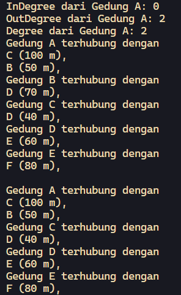
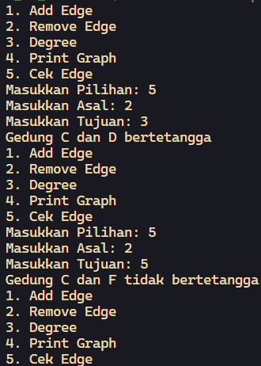
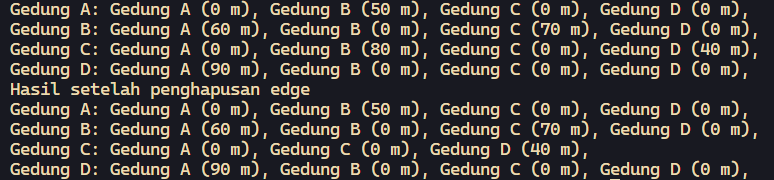
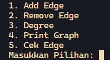

# <p align="center">JOBSHEET XII - GRAPH</p>

<br><br>

<p align="center">
    
</p>

<br><br>

<p align="center">
    Nama : Ahmad Naufal Waskito Aji <br>
    NIM : 2341720080 <br>
    Kelas : TI-1B <br>
    Prodi : D4 Teknik Informatika
</p>

***

## Percobaan 1:  Implementasi Graph menggunakan Linked List
### **1.1 Kode Percobaan**
``DoubleLinkedList04.java``
```java
    public class DoubleLinkedList04 {
        Node04 head;
        int size;

        public DoubleLinkedList04() {
            head = null;
            size = 0;
        }

        public boolean isEmpty() {
            return head == null;
        }

        public void addFirst(int item, int jarak) {
            if (isEmpty()) {
                head = new Node04(null, item, jarak, null);
            } else {
                Node04 newNode = new Node04(null, item, jarak, head);
                head.prev = newNode;
                head = newNode;
            }
            size++;
        }

        public void addLast(int item, int jarak) {
            if (isEmpty()) {
                addFirst(item, jarak);
            } else {
                Node04 current = head;
                while (current.next != null) {
                    current = current.next;
                }
                Node04 newNode = new Node04(current, item, jarak, null);
                current.next = newNode;
                size++;
            }
        }

        public void add(int item, int index, int jarak) throws Exception {
            if (isEmpty()) {
                addFirst(item, jarak);
            } else if (index < 0 || index > size) {
                throw new Exception("Nilai indeks di luar batas");
            } else {
                Node04 current = head;
                int i = 0;
                while (i < index) {
                    current = current.next;
                    i++;
                }
                if (current.prev == null) {
                    Node04 newNode = new Node04(null, item, jarak, current);
                    current.prev = newNode;
                    head = newNode;
                } else {
                    Node04 newNode = new Node04(current.prev, item, jarak, current);
                    newNode.prev = current.prev;
                    newNode.next = current;
                    current.prev.next = newNode;
                    current.prev = newNode;
                }
            }
            size++;
        }

        public int size() {
            return size;
        }

        public void clear() {
            head = null;
            size = 0;
        }

        public void print() {
            if (!isEmpty()) {
                Node04 tmp = head;
                while (tmp != null) {
                    System.out.print(tmp.data + "\t");
                    tmp = tmp.next;
                }
                System.out.println("\nberhasil diisi");
            } else {
                System.out.println("Linked Lists Kosong");
            }
        }

        public void removeFirst() throws Exception {
            if (isEmpty()) {
                throw new Exception("Linked List masih kosong, tidak dapat dihapus!");
            } else if (size == 1) {
                removeLast();
            } else {
                head = head.next;
                head.prev = null;
                size--;
            }
        }    

        public void removeLast() throws Exception {
            if (isEmpty()) {
                throw new Exception("Linked List masih kosong, tidak dapat dihapus!");
            } else if (head.next == null) {
                head = null;
                size--;
                return;
            }
            Node04 current = head;
            while (current.next.next != null) {
                current = current.next;
            }
            current.next = null;
            size--;
        }

        public void remove(int data) {
            Node04 current = head;
            while (current != null) {
                if (current.data == data) {
                    if (current.prev != null) {
                        current.prev.next = current.next;
                    } else {
                        head = current.next;
                    }
                    if (current.next != null) {
                        current.next.prev = current.prev;
                    }
                    size--;
                    break;
                }
                current = current.next;
            }
        }

        public int getFirst() throws Exception {
            if (isEmpty()) {
                throw new Exception("Linked List kosong");
            }
            return head.data;
        }

        public int getLast() throws Exception {
            if (isEmpty()) {
                throw new Exception("Linked List kosong");
            }
            Node04 tmp = head;
            while (tmp.next != null) {
                tmp = tmp.next;
            }
            return tmp.data;
        }

        public int get(int index) throws Exception {
            if (isEmpty() || index >= size) {
                throw new Exception("Nilai indeks di luar batas");
            }
            Node04 tmp = head;
            for (int i = 0; i < index; i++) {
                tmp = tmp.next;
            }
            return tmp.data;
        }

        public int getJarak(int index) throws Exception {
            if (isEmpty() || index >= size) {
                throw new Exception("Nilai indeks di luar batas");
            }
            Node04 tmp = head;
            for (int i = 0; i < index; i++) {
                tmp = tmp.next;
            }
            return tmp.jarak;
        }

        public void updateJarak(int index, int jarak) throws Exception {
            if (isEmpty() || index >= size) {
                throw new Exception("Nilai indeks di luar batas");
            }
            Node04 tmp = head;
            for (int i = 0; i < index; i++) {
                tmp = tmp.next;
            }
            
            tmp.jarak = jarak;
        }
    }
```

``Node04.java``
```java
    public class Node04 {
        int data;
        Node04 prev, next;
        int jarak;

        Node04(Node04 prev, int data, int jarak, Node04 next) {
            this.prev = prev;
            this.data = data;
            this.next = next;
            this.jarak = jarak;
        }
    }
```

``Graph04.java``
```java
    public class Graph04 {
        int vertex;
        DoubleLinkedList04 list[];

        public Graph04(int v) {
            vertex = v;
            list = new DoubleLinkedList04[v];
            for (int i = 0; i < v; i++) {
                list[i] = new DoubleLinkedList04();
            }
        }

        public void addEdge(int asal, int tujuan, int jarak) {
            list[asal].addFirst(tujuan, jarak);
            //list[tujuan].addFirst(tujuan, jarak);
        }

        public void degree(int asal) throws Exception {
            int k, totalIn = 0 , totalOut = 0;
            for (int i = 0; i < vertex; i++) {
                for (int j = 0; j < list[i].size(); j++) {
                    if (list[i].get(j) == asal) {
                        ++totalIn;
                    }
                }
                for (k = 0; k < list[asal].size(); k++) {
                    list[asal].get(k);
                }
                totalOut = k;
            }
            System.out.println("InDegree dari Gedung " + (char) ('A'+asal) + ": " + totalIn);
            System.out.println("OutDegree dari Gedung " + (char) ('A'+asal) + ": " + totalOut);
            System.out.println("Degree dari Gedung " + (char) ('A'+asal) + ": " + (totalIn + totalOut));

            //System.out.println("Degree dari Gedung " + (char) ('A'+asal) + ": " + list[asal].size);
        }

        public void removeEdge(int asal, int tujuan) {
            for (int i = 0; i < vertex; i++) {
                if (i == tujuan) {
                    list[asal].remove(tujuan);
                }
            }
        }

        public void removeAllEdges() {
            for (int i = 0; i < vertex; i++) {
                list[i].clear();
            }
            System.out.println("Graf berhasil dikosongkan");
        }

        public void printGraph() throws Exception {
            for (int i = 0; i < vertex; i++) {
                if (list[i].size() > 0) {
                    System.out.println("Gedung " + (char) ('A' + i) + " terhubung dengan ");
                    for (int j = 0; j < list[i].size(); j++) {
                        System.out.println((char) ('A' + list[i].get(j)) + " (" + list[i].getJarak(j) + " m), ");
                    }
                }
            }
        }

        public void updateJarak(int asal, int tujuan, int jarak) throws Exception {
            for (int i = 0; i < list[asal].size(); i++) {
                if (list[asal].get(i) == tujuan) {
                    list[asal].updateJarak(i, jarak);
                }
            }
        }
    }
```

``GraphMain04.java``
```java
    public class GraphMain04 {
        public static void main(String[] args) {
            Graph04 gedung = new Graph04(6);
            gedung.addEdge(0, 1, 50);
            gedung.addEdge(0, 2, 100);
            gedung.addEdge(1, 3, 70);
            gedung.addEdge(2, 3, 40);
            gedung.addEdge(3, 4, 60);
            gedung.addEdge(4, 5, 80);
            try {
                gedung.degree(0);
                gedung.printGraph();
                System.out.println();
                gedung.removeEdge(1, 3);
                gedung.printGraph();
            } catch (Exception e) {
                System.out.println(e);
            }
        }
    }
```


### **1.2 Verifikasi Hasil Percobaan**



### **1.3 Pertanyaan**
1.  Perbaiki kode program Anda apabila terdapat error atau hasil kompilasi kode tidak sesuai! <br>
    **Jawaban :**
    ``
    Menambahkan size-- pada method remove pada class DoubleLinkedList04.
    ``

2. Pada class Graph, terdapat atribut list[] bertipe DoubleLinkedList. Sebutkan tujuan pembuatan variabel tersebut! <br>
    **Jawaban :**
    ``
    Untuk menyimpan daftar adjacency (adjacency list) dari setiap simpul (vertex) dalam graf tersebut.
    ``

3. Jelaskan alur kerja dari method removeEdge! <br> 
    **Jawaban :**
    ``
    Alur kerja method removeEdge adalah untuk menghapus sebuah edge antara vertex yang ditentukan, yaitu asal dan tujuan. 
    ``

4. Apakah alasan pemanggilan method addFirst() untuk menambahkan data, bukan method add jenis lain saat digunakan pada method addEdge pada class Graph? <br>
    **Jawaban :**
    ``
    Penggunaan addFirst() tidak memerlukan penentuan posisi yang tepat di mana elemen baru harus ditambahkan. Elemen baru selalu ditambahkan di awal.
    ``
    
5. Modifikasi kode program sehingga dapat dilakukan pengecekan apakah terdapat jalur antara suatu node dengan node lainnya, seperti contoh berikut (Anda dapat memanfaatkan Scanner). <br>
    **Jawaban :**
    ```java
        public void cekEdge(int asal, int tujuan) throws Exception {
            for (int i = 0; i < list[asal].size(); i++) {
                if (list[asal].get(i) == tujuan) {
                    System.out.println("Gedung " + (char) ('A' + asal) + " dan " + (char) ('A' + tujuan) + " bertetangga");
                    return;
                }
            }
            System.out.println("Gedung " + (char) ('A' + asal) + " dan " + (char) ('A' + tujuan) + " tidak bertetangga");
        }
    ```

    


## Percobaan 2: Implementasi Graph menggunakan Matriks
### **2.1 Kode Percobaan**
``GraphMatriks04.java``
```java
    public class GraphMatriks04 {
        int vertex;
        int[][] matriks;

        public GraphMatriks04(int v) {
            vertex = v;
            matriks = new int[v][v];
        }

        public void makeEdge(int asal, int tujuan, int jarak) {
            matriks[asal][tujuan] = jarak;
        }

        public void removeEdge(int asal, int tujuan) {
            matriks[asal][tujuan] = -1;
        }

        public void printGraph() {
            for (int i = 0; i < vertex; i++) {
                System.out.print("Gedung " + (char) ('A' + i) + ": ");
                for (int j = 0; j < vertex; j++) {
                    if (matriks[i][j] != -1) {
                        System.out.print("Gedung " + (char) ('A' + j) + " (" + matriks[i][j] + " m), ");
                    }
                }
                System.out.println();
            }
        }
    }
```

### **2.2 Verifikasi Hasil Percobaan**



### **1.3 Pertanyaan**
1.  Perbaiki kode program Anda apabila terdapat error atau hasil kompilasi kode tidak sesuai! <br>
    **Jawaban :**
    ``
    Tidak terdapat error.
    ``

2. Apa jenis graph yang digunakan pada Percobaan 2? <br>
    **Jawaban :**
    ``
    Weighted graph.
    ``

3. Apa maksud dari dua baris kode berikut? <br>
    ```java
        gdg.makeEdge(1, 2, 70);
        gdg.makeEdge(2, 1, 80);
    ```
    **Jawaban :**
    ``
    Membuat suatu edge yang menghubungkan asal dan tujuan serta memberikan jarak.
    ``

4. Modifikasi kode program sehingga terdapat method untuk menghitung degree, termasuk inDegree dan outDegree! <br>
    **Jawaban :**
    ```java
        public void degree(int asal) throws Exception {
            int k, totalIn = 0 , totalOut = 0;
            for (int i = 0; i < vertex; i++) {
                for (int j = 0; j < list[i].size(); j++) {
                    if (list[i].get(j) == asal) {
                        ++totalIn;
                    }
                }
                for (k = 0; k < list[asal].size(); k++) {
                    list[asal].get(k);
                }
                totalOut = k;
            }
            System.out.println("InDegree dari Gedung " + (char) ('A'+asal) + ": " + totalIn);
            System.out.println("OutDegree dari Gedung " + (char) ('A'+asal) + ": " + totalOut);
            System.out.println("Degree dari Gedung " + (char) ('A'+asal) + ": " + (totalIn + totalOut));

            //System.out.println("Degree dari Gedung " + (char) ('A'+asal) + ": " + list[asal].size);
        }
    ```

## Tugas 1
Modifikasi kode program pada class GraphMain sehingga terdapat menu program yang bersifat dinamis, setidaknya terdiri dari: <br>
a) Add Edge <br>
b) Remove Edge <br>
c) Degree <br>
d) Print Graph <br>
e) Cek Edge <br>
Pengguna dapat memilih menu program melalui input Scanner

### **Kode Percobaan**
```java
    import java.util.Scanner;

    public class GraphMain04 {
        public static void main(String[] args) {
            int asal, tujuan, jarak;

            Scanner scanner04 = new Scanner(System.in);
            Graph04 gedung = new Graph04(6);

            gedung.addEdge(0, 1, 50);
            gedung.addEdge(0, 2, 100);
            gedung.addEdge(1, 3, 70);
            gedung.addEdge(2, 3, 40);
            gedung.addEdge(3, 4, 60);
            gedung.addEdge(4, 5, 80);

            while (true) {
                System.out.println("1. Add Edge");
                System.out.println("2. Remove Edge");
                System.out.println("3. Degree");
                System.out.println("4. Print Graph");
                System.out.println("5. Cek Edge");
                System.out.print("Masukkan Pilihan: ");

                int menu = scanner04.nextInt();

                switch (menu) {
                    case 1:
                        System.out.print("Masukkan Asal: ");
                        asal = scanner04.nextInt();
                        System.out.print("Masukkan Tujuan: ");
                        tujuan = scanner04.nextInt();
                        System.out.print("Masukkan Jarak: ");
                        jarak = scanner04.nextInt();
                        gedung.addEdge(asal, tujuan, jarak);
                        break;

                    case 2:
                        System.out.print("Masukkan Asal: ");
                        asal = scanner04.nextInt();
                        System.out.print("Masukkan Tujuan: ");
                        tujuan = scanner04.nextInt();
                        gedung.removeEdge(asal, tujuan);
                        break;

                    case 3:
                        System.out.print("Masukkan Asal: ");
                        asal = scanner04.nextInt();
                        try {
                            gedung.degree(asal);
                        } catch (Exception e) {
                            System.out.println(e);
                        }
                        break;

                    case 4:
                        try {
                            gedung.printGraph();
                        } catch (Exception e) {
                            System.out.println(e);
                        }
                        break;

                    case 5:
                        System.out.print("Masukkan Asal: ");
                        asal = scanner04.nextInt();
                        System.out.print("Masukkan Tujuan: ");
                        tujuan = scanner04.nextInt();
                        try {
                            gedung.cekEdge(asal, tujuan);  
                        } catch (Exception e) {
                            System.out.println(e);
                        }
                        break;
                }

            }

        }
    }
```

### **Verifikasi Hasil Percobaan**

