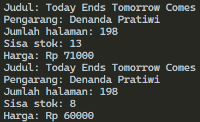
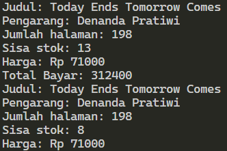
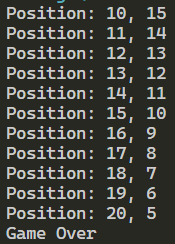

# <p align="center">JOBSHEET II - OBJECT</p>

<br><br>

<p align="center">
    
</p>

<br><br>

<p align="center">
    Nama : Ahmad Naufal Waskito Aji <br>
    NIM : 2341720080 <br>
    Kelas : TI-1B <br>
    Prodi : D4 Teknik Informatika
</p>

***

## Percobaan 1: Deklarasi Class, Atribut dan Method
### **1.1 Kode Percobaan**
```java
public class Buku04 {

    String judul, pengarang;
    int halaman, stok, harga;

    void tampilInformasi() {
        System.out.println("Judul: " + judul);
        System.out.println("Pengarang: " + pengarang);
        System.out.println("Jumlah halaman: " + halaman);
        System.out.println("Sisa stok: " + stok);
        System.out.println("Harga: Rp " + harga);
    }

    void terjual(int jml) {
        stok -= jml;
    }

    void restock(int jml) {
        stok += jml;
    }

    void gantiHarga(int hrg) {
        harga = hrg;
    }

}
```

### **1.2 Verifikasi Hasil Percobaan**


### **1.3 Pertanyaan**
1. Sebutkan dua karakteristik class atau object! <br>
    **Jawaban :**
    ``
    Karakteristik class atau object adalah "Mempunyai Sesuatu" dan "Melakukan Sesuatu"
    ``

2. Perhatikan class Buku pada Praktikum 1 tersebut, ada berapa atribut yang dimiliki oleh class
Buku? Sebutkan apa saja atributnya! <br>
    **Jawaban :**
    ``
    Pada praktikum 1 terdapat 5 atribut, yaitu judul, pengarang, halaman, stok, harga
    ``
        
3. Ada berapa method yang dimiliki oleh class tersebut? Sebutkan apa saja methodnya! <br>
    **Jawaban :**
    ``
    Pada class tersebut terdapat 4 method, yaitu tampilInformasi(), terjual(), restock(), gantiHarga()
    ``

4. Perhatikan method terjual() yang terdapat di dalam class Buku. Modifikasi isi method tersebut sehingga proses pengurangan hanya dapat dilakukan jika stok masih ada (lebih besar dari 0)! <br>
    **Jawaban :**
    ```java
    void terjual(int jml) {
        if(stok > jml) {
            stok -= jml;
        }
    }
    ```

5. Menurut Anda, mengapa method restock() mempunyai satu parameter berupa bilangan int? <br>
    **Jawaban :**
    ``
    Method restock() memiliki 1 paramater karena hanya membutuhkan jumlah buku yang ingin di restock
    ``


## Percobaan 2: Instansiasi Object, serta Mengakses Atribut dan Method
### **2.1 Kode Percobaan**
```java
public class BukuMain04 {
    public static void main(String[] args) {
       
        Buku04 bk1 = new Buku04();
        bk1.judul = "Today Ends Tomorrow Comes";
        bk1.pengarang = "Denanda Pratiwi";
        bk1.halaman = 198;
        bk1.stok = 13;
        bk1.harga = 71000;

        bk1.tampilInformasi();
        bk1.terjual(5);
        bk1.gantiHarga(60000);
        bk1.tampilInformasi();

    }
}
```

### **2.2 Verifikasi Hasil Percobaan**



### **2.3 Pertanyaan**
1. Pada class BukuMain, tunjukkan baris kode program yang digunakan untuk proses instansiasi! Apa nama object yang dihasilkan? <br>
    **Jawaban :**
    ``
    Nama object yang dihasilkan adalah bk1
    ``
    ```java
    Buku04 bk1 = new Buku04();
    ```

2. Bagaimana cara mengakses atribut dan method dari suatu objek? <br>
    **Jawaban :**
    ``
    Untuk mengakses atribut dan method daru suatu objek, maka kita perlu memasukkan nama object, dilanjutkan dengan tanda . (titik), kemudian memasukkan nama atribut atau method 
    ``

3. Mengapa hasil output pemanggilan method tampilInformasi() pertama dan kedua berbeda? <br>
    **Jawaban :**
    ``
    Karena informasi pertama dan kedua dari objek yang berbeda
    ``


## Percobaan 3: Membuat Konstruktor
### **3.1 Kode Percobaan**
```java
public class Buku04 {

    String judul, pengarang;
    int halaman, stok, harga;

    void tampilInformasi() {
        System.out.println("Judul: " + judul);
        System.out.println("Pengarang: " + pengarang);
        System.out.println("Jumlah halaman: " + halaman);
        System.out.println("Sisa stok: " + stok);
        System.out.println("Harga: Rp " + harga);
    }

    void terjual(int jml) {
        stok -= jml;
    }

    void restock(int jml) {
        stok += jml;
    }

    void gantiHarga(int hrg) {
        harga = hrg;
    }

    public Buku04() {

    }

    public Buku04(String jud, String pg, int hal, int stok, int har) {
        judul = jud;
        pengarang = pg;
        halaman = hal;
        this.stok = stok;
        harga = har;
    }

}
```

### **3.2 Verifikasi Hasil Percobaan**


### **3.3 Pertanyaan**

1. Pada class Buku di Percobaan 3, tunjukkan baris kode program yang digunakan untuk mendeklarasikan konstruktor berparameter! <br>
    **Jawaban :**
    ```java
    public Buku04(String jud, String pg, int hal, int stok, int har) {
        judul = jud;
        pengarang = pg;
        halaman = hal;
        this.stok = stok;
        harga = har;
    }
    ```

2. Perhatikan class BukuMain. Apa sebenarnya yang dilakukan pada baris program berikut? <br>
    **Jawaban :**
    ``
    Baris kode tersebut melakukan instansiasi berparameter
    ``

3. Hapus konstruktor default pada class Buku, kemudian compile dan run program. Bagaimana hasilnya? Jelaskan mengapa hasilnya demikian!  <br>
    **Jawaban :**
    ``
    Muncul peringatan "The constructor Buku04() is undefined", hal ini dikarenakan pada BukuMain04.java terdapat 2 instansiasi, yang pertama tidak terdapat paramater, yang kedua membutuhkan parameter, sehingga konstruktor nya pun juga berbeda
    ``
    
4. Setelah melakukan instansiasi object, apakah method di dalam class Buku harus diakses secara berurutan? Jelaskan alasannya! <br>
    **Jawaban :** 
    ``
    Setelah melakukan instansiasi objek, method tidak perlu diakses secara berurutan, setiap method bersifat independen, tidak bergantung pada urutan pemanggilan
    ``

5. Buat object baru dengan nama buku<NamaMahasiswa> menggunakan konstruktor berparameter dari class Buku! <br>
    **Jawaban :**
    ```java
    Buku04 BukuNaufal = new Buku04("Tips Gacha Wangy", "Ahmad Naufal Waskito Aji", 1250, 5, 175000);
    BukuNaufal.tampilInformasi();
    ```


## Latihan Praktikum

### 4.1 Latihan 1
Pada class Buku yang telah dibuat, tambahkan tiga method yaitu hitungHargaTotal(),
hitungDiskon(), dan hitungHargaBayar() dengan penjelasan sebagai berikut: <br>
- Method hitungHargaTotal() digunakan untuk menghitung harga total yang merupakan perkalian antara harga dengan jumlah buku yang terjual <br>
- Method hitungDiskon() digunakan untuk menghitung diskon dengan aturan berikut: <br>
    - Jika harga total lebih dari 150000, maka harga didiskon sebesar 12% <br>
    - Jika harga total antara 75000 sampai 150000, maka harga didiskon sebesar 5% <br>
    - Jika harga total kurang dari 75000, maka harga tidak didiskon <br>
- Method hitungHargaBayar() digunakan untuk menghitung harga total setelah dikurangi diskon

    ```java
    public class Buku04 {

        String judul, pengarang;
        int halaman, stok, harga, terjual;

        void tampilInformasi() {
            System.out.println("Judul: " + judul);
            System.out.println("Pengarang: " + pengarang);
            System.out.println("Jumlah halaman: " + halaman);
            System.out.println("Sisa stok: " + stok);
            System.out.println("Harga: Rp " + harga);
        }

        void terjual(int jml) {
            if(stok > jml) {
                stok -= jml;
                terjual = jml;
                System.out.println("Total Bayar: " + hitungHargaBayar());
            }   
        }

        void restock(int jml) {
            stok += jml;
        }

        void gantiHarga(int hrg) {
            harga = hrg;
        }

        public Buku04() {

        }

        public Buku04(String jud, String pg, int hal, int stok, int har) {
            judul = jud;
            pengarang = pg;
            halaman = hal;
            this.stok = stok;
            harga = har;
        }

        int hitungHargaTotal() {
            return harga * terjual;
        }

        int hitungDiskon() {
            if (hitungHargaTotal() > 150000) {
                return hitungHargaTotal() * 12 / 100;
            } else if (hitungHargaTotal() >= 75000 && hitungHargaTotal() <= 150000) {
                return hitungHargaTotal() * 5 / 100;
            } else {
                return hitungHargaTotal();
            }
        }

        int hitungHargaBayar() {
            return hitungHargaTotal() - hitungDiskon();
        }


    }
    ```

    **Hasil Percobaan**

    


### 4.2 Latihan 2
Buat program berdasarkan class diagram berikut ini!
Penjelasan dari atribut dan method pada class Dragon tersebut adalah sebagai berikut:
- Atribut x digunakan untuk menyimpan posisi koordinat x (mendatar) dari dragon, sedangkan atribut y untuk posisi koordinat y (vertikal)
- Atribut width digunakan untuk menyimpan lebar dari area permainan, sedangkan height untuk menyimpan panjang area
- Method moveLeft() digunakan untuk mengubah posisi dragon ke kiri (koordinat x akan berkurang 1), sedangkan moveRight() untuk bergerak ke kanan (koordinat x akan bertambah 1). Perlu diperhatikan bahwa koordinat x tidak boleh lebih kecil dari 0 atau lebih besar dari  nilai width. Jika koordinat x < 0 atau x > width maka panggil method detectCollision()
- Method moveUp() digunakan untuk mengubah posisi dragon ke atas (koordinat y akan berkurang 1), sedangkan moveDown() untuk bergerak ke bawah (koordinat y akan bertambah 1). Perlu diperhatikan bahwa koordinat y tidak boleh lebih kecil dari 0 atau lebih besar dari nilai height. Jika koordinat y < 0 atau y > height maka panggil method detectCollision()
- Method detectCollision() akan mencetak pesan “Game Over” apabila dragon menyentuh ujung area permainan

    **Dragon04.java**

    ```java
    public class Dragon04 {

        int x, y, width, height;

        void moveLeft() {
            if (x > 0) {
                x -= 1;
            } else {
                detectCollision(x, y);
            }
        }

        void moveRight() {
            if (x < width) {
                x += 1;
            } else {
                detectCollision(x, y);
            }
        }

        void moveUp() {
            if (y > 0) {
                y -= 1;
            } else {
                detectCollision(x, y);
            }
        }

        void moveDown() {
            if (x < height) {
                x += 1;
            } else {
                detectCollision(x, y);
            }
        }

        void printPosition() {
            System.out.println("Position: " + x + ", " + y);
        }

        void detectCollision(int x, int y) {
            System.out.println("Game Over");
            System.exit(0);
        }

    }
    ```

    **DragonMain04.java**
    ```java
    public class DragonMain04 {
        public static void main(String[] args) {
        
            Dragon04 dg1 = new Dragon04();
            dg1.height = 20;
            dg1.width = 20;
            dg1.x = 10;
            dg1.y = 15;

            dg1.printPosition();

            for (int i = 0; i<20; i++) {
                dg1.moveRight();
                dg1.moveUp();
                dg1.printPosition();
            }

        }
    }

    ```

    **Hasil Percobaan**

    