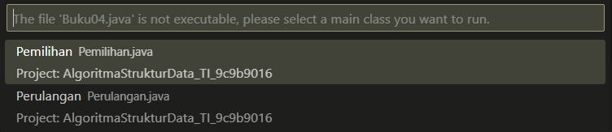
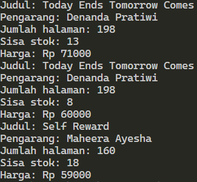

# JOBSHEET 2 - OBJECT

**Nama :** Ahmad Naufal Waskito Aji<br>
**NIM :** 2341720080<br>
**Kelas :** TI-1B<br>
**Absen :** 04

## 2.1 Percobaan 1: Deklarasi Class, Atribut dan Method
### **2.1.1 Langkah-langkah percobaan**
```java
public class Buku04 {

    String judul, pengarang;
    int halaman, stok, harga;

    void tampilInformasi() {
        System.out.println("Judul: " + judul);
        System.out.println("Pengarang: " + pengarang);
        System.out.println("Jumlah halaman: " + halaman);
        System.out.println("Sisa stok: " + stok);
        System.out.println("Harga: Rp " + harga);
    }

    void terjual(int jml) {
        stok -= jml;
    }

    void restock(int jml) {
        stok += jml;
    }

    void gantiHarga(int hrg) {
        harga = hrg;
    }

}
```

### **2.1.2 Verifikasi Hasil Percobaan**



### **2.1.3 Pertanyaan**
1. Sebutkan dua karakteristik class atau object!
2. Perhatikan class Buku pada Praktikum 1 tersebut, ada berapa atribut yang dimiliki oleh class
Buku? Sebutkan apa saja atributnya!
3. Ada berapa method yang dimiliki oleh class tersebut? Sebutkan apa saja methodnya!
4. Perhatikan method terjual() yang terdapat di dalam class Buku. Modifikasi isi method tersebut
sehingga proses pengurangan hanya dapat dilakukan jika stok masih ada (lebih besar dari 0)!
5. Menurut Anda, mengapa method restock() mempunyai satu parameter berupa bilangan int?
6. Commit dan push kode program ke Github

Jawaban<br>
1. -<br>
2. Pada praktikum 1 terdapat 5 atribut, yaitu judul, pengarang, halaman, stok, harga<br>
3. Pada class tersebut terdapat 4 method, yaitu tampilInformasi(), terjual(), restock(), gantiHarga()<br>
4. -
    ```java
    void terjual(int jml) {
        if(stok > jml) {
            stok -= jml;
        }
    }
    ```
5. Method restock() memiliki 1 paramater karena hanya membutuhkan jumlah buku yang ingin di restock
6. -

## 2.2 Percobaan 2: Instansiasi Object, serta Mengakses Atribut dan Method
### **2.2.1 Langkah-langkah percobaan**
```java
public class BukuMain04 {
    public static void main(String[] args) {
       
        Buku04 bk1 = new Buku04();
        bk1.judul = "Today Ends Tomorrow Comes";
        bk1.pengarang = "Denanda Pratiwi";
        bk1.halaman = 198;
        bk1.stok = 13;
        bk1.harga = 71000;

        bk1.tampilInformasi();
        bk1.terjual(5);
        bk1.gantiHarga(60000);
        bk1.tampilInformasi();

    }
}
```

### **2.2.2 Verifikasi Hasil Percobaan**


### **2.2.3 Pertanyaan**
1. Pada class BukuMain, tunjukkan baris kode program yang digunakan untuk proses instansiasi!
Apa nama object yang dihasilkan?
2. Bagaimana cara mengakses atribut dan method dari suatu objek?
3. Mengapa hasil output pemanggilan method tampilInformasi() pertama dan kedua berbeda?

Jawaban<br>
1. Nama object yang dihasilkan adalah bk1
    ```java
    Buku04 bk1 = new Buku04();
    ```
2. Untuk mengakses atribut dan method daru suatu objek, maka kita perlu memasukkan nama object, dilanjutkan dengan tanda . (titik), kemudian memasukkan nama atribut atau method 
3. Karena informasi pertama dan kedua dari objek yang berbeda


## 2.3 Percobaan 3: Membuat Konstruktor
### **2.3.1 Langkah-langkah percobaan**
```java
public class Buku04 {

    String judul, pengarang;
    int halaman, stok, harga;

    void tampilInformasi() {
        System.out.println("Judul: " + judul);
        System.out.println("Pengarang: " + pengarang);
        System.out.println("Jumlah halaman: " + halaman);
        System.out.println("Sisa stok: " + stok);
        System.out.println("Harga: Rp " + harga);
    }

    void terjual(int jml) {
        stok -= jml;
    }

    void restock(int jml) {
        stok += jml;
    }

    void gantiHarga(int hrg) {
        harga = hrg;
    }

    public Buku04() {

    }

    public Buku04(String jud, String pg, int hal, int stok, int har) {
        judul = jud;
        pengarang = pg;
        halaman = hal;
        this.stok = stok;
        harga = har;
    }

}
```

### **2.3.2 Verifikasi Hasil Percobaan**



### **2.3.3 Pertanyaan**

1. Pada class Buku di Percobaan 3, tunjukkan baris kode program yang digunakan untuk
mendeklarasikan konstruktor berparameter!
2. Perhatikan class BukuMain. Apa sebenarnya yang dilakukan pada baris program berikut?
3. Hapus konstruktor default pada class Buku, kemudian compile dan run program. Bagaimana
hasilnya? Jelaskan mengapa hasilnya demikian!
4. Setelah melakukan instansiasi object, apakah method di dalam class Buku harus diakses
secara berurutan? Jelaskan alasannya!
5. Buat object baru dengan nama buku<NamaMahasiswa> menggunakan konstruktor
berparameter dari class Buku!
6. Commit dan push kode program ke Github

Jawaban<br>
1. -
    ```java
    public Buku04(String jud, String pg, int hal, int stok, int har) {
        judul = jud;
        pengarang = pg;
        halaman = hal;
        this.stok = stok;
        harga = har;
    }
    ```
2. Baris kode tersebut melakukan instansiasi berparameter
3. Muncul peringatan "The constructor Buku04() is undefined", hal ini dikarenakan pada BukuMain04.java terdapat 2 instansiasi, yang pertama tidak terdapat paramater, yang kedua membutuhkan parameter, sehingga konstruktor nya pun juga berbeda
4. Setelah melakukan instansiasi objek, method tidak perlu diakses secara berurutan, setiap method bersifat independen, tidak bergantung pada urutan pemanggilan
5. 
    ```java
    Buku04 BukuNaufal = new Buku04("Tips Gacha Wangy", "Ahmad Naufal Waskito Aji", 1250, 5, 175000);
    BukuNaufal.tampilInformasi();
    ```
6. -

## 2.4 Latihan Praktikum
1. Pada class Buku yang telah dibuat, tambahkan tiga method yaitu hitungHargaTotal(),
hitungDiskon(), dan hitungHargaBayar() dengan penjelasan sebagai berikut:
o Method hitungHargaTotal() digunakan untuk menghitung harga total yang merupakan perkalian antara harga dengan jumlah buku yang terjual
o Method hitungDiskon() digunakan untuk menghitung diskon dengan aturan berikut:
    ▪ Jika harga total lebih dari 150000, maka harga didiskon sebesar 12%
    ▪ Jika harga total antara 75000 sampai 150000, maka harga didiskon sebesar 5%
    ▪ Jika harga total kurang dari 75000, maka harga tidak didiskon
o Method hitungHargaBayar() digunakan untuk menghitung harga total setelah dikurangi diskon

```java
    int hitungHargaTotal(int jml) {
        return harga * jml;
    }

    int hitungDiskon(int jml) {
        if (hitungHargaTotal(jml) > 150000) {
            return hitungHargaTotal(jml) * 12 / 100;
        } else if (hitungHargaTotal(jml) >= 750005 && hitungHargaTotal(jml) <= 150000 ) {
            return hitungHargaTotal(jml) * 5 / 100;
        } else {
            return hitungHargaTotal(jml);
        }
    }

    int hitungHargaBayar(int jml) {
        return hitungHargaTotal(jml)-hitungDiskon(jml);
    }
```

2. Buat program berdasarkan class diagram berikut ini!
Penjelasan dari atribut dan method pada class Dragon tersebut adalah sebagai berikut:
• Atribut x digunakan untuk menyimpan posisi koordinat x (mendatar) dari dragon, sedangkan atribut y untuk posisi koordinat y (vertikal)
• Atribut width digunakan untuk menyimpan lebar dari area permainan, sedangkan height untuk menyimpan panjang area
• Method moveLeft() digunakan untuk mengubah posisi dragon ke kiri (koordinat x akan berkurang 1), sedangkan moveRight() untuk bergerak ke kanan (koordinat x akan bertambah 1). Perlu diperhatikan bahwa koordinat x tidak boleh lebih kecil dari 0 atau lebih besar dari nilai width. Jika koordinat x < 0 atau x > width maka panggil method detectCollision()
• Method moveUp() digunakan untuk mengubah posisi dragon ke atas (koordinat y akan berkurang 1), sedangkan moveDown() untuk bergerak ke bawah (koordinat y akan bertambah 1). Perlu diperhatikan bahwa koordinat y tidak boleh lebih kecil dari 0 atau lebih besar dari nilai height. Jika koordinat y < 0 atau y > height maka panggil method detectCollision()
• Method detectCollision() akan mencetak pesan “Game Over” apabila dragon menyentuh ujung area permainan.

