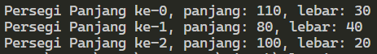
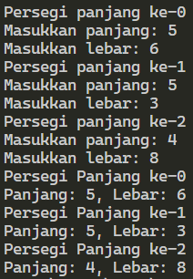
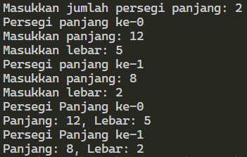
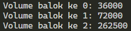
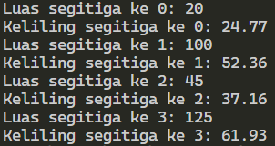
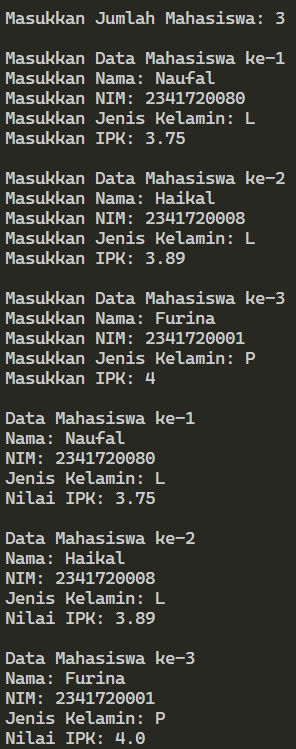
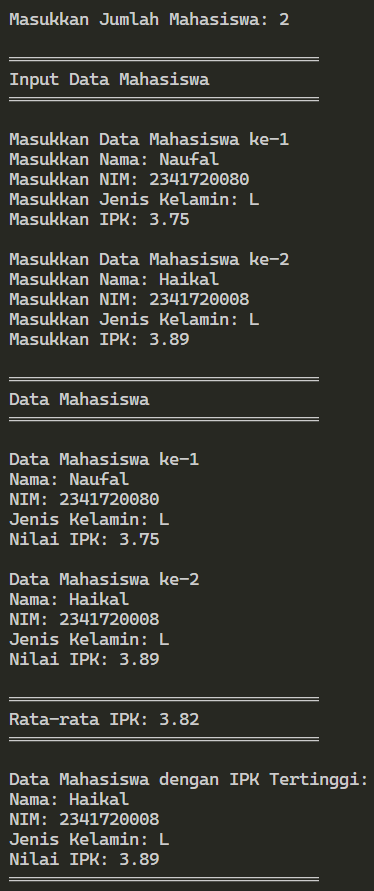

# <p align="center">JOBSHEET III - ARRAY OF OBJEK</p>

<br><br>

<p align="center">
    
</p>

<br><br>

<p align="center">
    Nama : Ahmad Naufal Waskito Aji <br>
    NIM : 2341720080 <br>
    Kelas : TI-1B <br>
    Prodi : D4 Teknik Informatika
</p>

***

## Percobaan 1: Membuat Array dari Object, Mengisi dan Menampilkan
### **1.1 Kode Percobaan**
``ArrayObject.java``
```java
public class ArrayObjects {
    public static void main(String[] args) {
        PersegiPanjang[] ppArray = new PersegiPanjang[3];

        ppArray[0] = new PersegiPanjang();
        ppArray[0].panjang = 110;
        ppArray[0].lebar = 30;

        ppArray[1] = new PersegiPanjang();
        ppArray[1].panjang = 80;
        ppArray[1].lebar = 40;

        ppArray[2] = new PersegiPanjang();
        ppArray[2].panjang = 100;
        ppArray[2].lebar = 20;

        System.out.println("Persegi Panjang ke-0, panjang: " + ppArray[0].panjang + ", lebar: " + ppArray[0].lebar);
        System.out.println("Persegi Panjang ke-1, panjang: " + ppArray[1].panjang + ", lebar: " + ppArray[1].lebar);
        System.out.println("Persegi Panjang ke-2, panjang: " + ppArray[2].panjang + ", lebar: " + ppArray[2].lebar);
    }
}
```

``PersegiPanjang.java``
```java
public class PersegiPanjang {
    public int panjang;
    public int lebar;
}
```

### **1.2 Verifikasi Hasil Percobaan**



### **1.3 Pertanyaan**
1. Berdasarkan uji coba 3.2, apakah class yang akan dibuat array of object harus selalu memiliki atribut dan sekaligus method?Jelaskan! <br>
    **Jawaban :**
    ``
    yntkts
    ``

2. Apakah class PersegiPanjang memiliki konstruktor?Jika tidak, kenapa dilakukan pemanggilan konstruktur pada baris program berikut : <br>
    **Jawaban :**
    ``
    yntkts
    ``

3. Apa yang dimaksud dengan kode berikut ini: <br>
    **Jawaban :**
    ``
    yntkts
    ``

4. Apa yang dimaksud dengan kode berikut ini: <br>
    **Jawaban :**
    ``
    yntkts
    ``

5. Mengapa class main dan juga class PersegiPanjang dipisahkan pada uji coba 3.2? <br>
    **Jawaban :**
    ``
    yntkts
    ``

## Percobaan 2: Menerima Input Isian Array Menggunakan Looping
### **2.1 Kode Percobaan**
``ArrayObject.java``
```java
import java.util.Scanner;

public class ArrayObjects {
    public static void main(String[] args) {
        Scanner sc = new Scanner(System.in);
        PersegiPanjang[] ppArray = new PersegiPanjang[3];

        for(int i=0; i<3; i++) {

            ppArray[i] = new PersegiPanjang();
            System.out.println("Persegi panjang ke-" + i);
            System.out.print("Masukkan panjang: ");
            ppArray[i].panjang = sc.nextInt();
            System.out.print("Masukkan lebar: ");
            ppArray[i].lebar = sc.nextInt();
    
        }
        
        for(int i=0; i<3; i++) {
            System.out.println("Persegi Panjang ke-" + i);
            System.out.println("Panjang: " + ppArray[i].panjang + ", Lebar: " + ppArray[i].lebar);
        }

    }
}
```
### **2.2 Verifikasi Hasil Percobaan**



### **2.3 Pertanyaan**
1. Apakah array of object dapat diimplementasikan pada array 2 Dimensi? <br>
    **Jawaban :**
    ``
    yntkts
    ``

2. Jika jawaban soal no satu iya, berikan contohnya! Jika tidak, jelaskan! <br>
    **Jawaban :**
    ``
    yntkts
    ``

3. Jika diketahui terdapat class Persegi yang memiliki atribut sisi bertipe integer, maka kode dibawah ini akan memunculkan error saat dijalankan. Mengapa? <br>
    **Jawaban :**
    ``
    yntkts
    ``

4. Modifikasi kode program pada praktikum 3.3 agar length array menjadi inputan dengan Scanner! <br>
    **Jawaban :**

    ``ArrayObjects.java``
    ```java
    import java.util.Scanner;

    public class ArrayObjects {
        public static void main(String[] args) {
            Scanner sc = new Scanner(System.in);

            System.out.print("Masukkan jumlah persegi panjang: ");
            PersegiPanjang[] ppArray = new PersegiPanjang[sc.nextInt()];

            for(int i=0; i<ppArray.length; i++) {

                ppArray[i] = new PersegiPanjang();
                System.out.println("Persegi panjang ke-" + i);
                System.out.print("Masukkan panjang: ");
                ppArray[i].panjang = sc.nextInt();
                System.out.print("Masukkan lebar: ");
                ppArray[i].lebar = sc.nextInt();
        
            }
            
            for(int i=0; i<ppArray.length; i++) {
                System.out.println("Persegi Panjang ke-" + i);
                System.out.println("Panjang: " + ppArray[i].panjang + ", Lebar: " + ppArray[i].lebar);
            }

        }
    }
    ```

    


5. Apakah boleh Jika terjadi duplikasi instansiasi array of objek, misalkan saja instansiasi dilakukan pada ppArray[i] sekaligus ppArray[0]? Jelaskan !
    **Jawaban :**
    ``
    yntkts
    ``

## Percobaan 3: Penambahan Operasi Matematika di Dalam Method
### **3.1 Kode Percobaan**
``Balok.java``
```java
public class Balok {
    public int panjang;
    public int lebar;
    public int tinggi;

    public Balok(int p, int l, int t) {
        panjang = p;
        lebar = l;
        tinggi = t;
    }

    public int hitungVolume() {
        return panjang * lebar * tinggi;
    }
}

```

``ArrayBalok.java``
```java
public class ArrayBalok {
    public static void main(String[] args) {
        Balok[] blArray = new Balok[3];

        blArray[0] = new Balok(100, 30, 12);
        blArray[1] = new Balok(120, 40, 15);
        blArray[2] = new Balok(210, 50, 25);

        for(int i=0; i<3; i++) {
            System.out.println("Volume balok ke " + i + ": " + blArray[i].hitungVolume());
        }
    }
}
```

### **3.2 Verifikasi Hasil Percobaan**



### **3.3 Pertanyaan**
1. Dapatkah konstruktor berjumlah lebih dalam satu kelas? Jelaskan dengan contoh! <br>
    **Jawaban :**
    ``
    yntkts
    ``

2. Jika diketahui terdapat class Segitiga seperti berikut ini:
Tambahkan konstruktor pada class Segitiga tersebut yang berisi parameter int a, int t yang masing-masing digunakan untuk mengisikan atribut alas dan tinggi. <br>
    **Jawaban :**

    ``Segitiga.java``
    ```java
    public class Segitiga {
        
        public int alas;
        public int tinggi;

        public Segitiga(int a, int t) {
            alas = a;
            tinggi = t;
        }
        
    }
    ```

3. Tambahkan method hitungLuas() dan hitungKeliling() pada class Segitiga tersebut. Asumsi segitiga adalah segitiga siku-siku. (Hint: Anda dapat menggunakan bantuan library Math pada Java untuk mengkalkulasi sisi miring) <br>
    **Jawaban :**
    ```java
    public int hitungLuas() {
        return (int)(0.5 * alas * tinggi);
    }

    public int hitungKeliling() {
        return alas + tinggi + (int)Math.sqrt(alas*alas + tinggi*tinggi);
    }
    ```

4. Pada fungsi main, buat array Segitiga sgArray yang berisi 4 elemen, isikan masing-masing atributnya sebagai berikut: <br>
    **Jawaban :**
    ```java
    public class ArraySegitiga {
        public static void main(String[] args) {
            Segitiga[] sgArray = new Segitiga[4];

            sgArray[0] = new Segitiga(10, 4);
            sgArray[1] = new Segitiga(20, 10);
            sgArray[2] = new Segitiga(15, 6);
            sgArray[3] = new Segitiga(25, 10);
        }
    }
    ```

5. Kemudian menggunakan looping, cetak luas dan keliling dengan cara memanggil method hitungLuas() dan hitungKeliling() <br>
    **Jawaban :**
    ```java
    public class ArraySegitiga {
        public static void main(String[] args) {
            Segitiga[] sgArray = new Segitiga[4];

            sgArray[0] = new Segitiga(10, 4);
            sgArray[1] = new Segitiga(20, 10);
            sgArray[2] = new Segitiga(15, 6);
            sgArray[3] = new Segitiga(25, 10);

            for(int i=0; i<4; i++) {
                System.out.println("Luas segitiga ke " + i + ": " + sgArray[i].hitungLuas());
                System.out.println("Keliling segitiga ke " + i + ": " + sgArray[i].hitungKeliling());
            }
        }
    }
    ```

    

## Latihan Praktikum

### 4.1 Latihan 1
Buatlah program yang dapat menghitung luas permukaan dan volume bangun ruang kerucut, limas segi empat sama sisi, dan bola. Buatlah 3 (tiga) class sesuai dengan jumlah jenis bangun ruang. Buatlah satu main class untuk membuat array of objects yang menginputkan atribut-atribut yang ada menggunakan konstruktor semua bangun ruang tersebut. Dengan ketentuan,
a. Buat looping untuk menginputkan masing-masing atributnya, kemudian tampilkan luas permukaan dan volume dari tiap jenis bangun ruang tersebut.
b. Pada kerucut, inputan untuk atribut hanya jari-jari dan sisi miring
c. Pada limas segi empat sama sisi, inputan untuk atribut hanya panjang sisi alas dan 
tinggi limas
d. Pada bola, inpuntan untuk atribut hanya jari-jari

### 4.2 Latihan 2
Sebuah kampus membutuhkan program untuk menampilkan informasi mahasiswa berupa nama, nim, jenis kelamin dan juga IPK mahasiswa.  Program dapat menerima input semua informasi tersebut, kemudian menampilkanya kembali ke user. Implementasikan program tersebut jika  dimisalkan terdapat 3 data mahasiswa yang tersedia.

``Class Mahasiswa``
```java
public class Mahasiswa {

    String nama, nim;
    char kelamin;
    double ipk;

    public Mahasiswa() {
        
    }

}
```

``Main Latihan2.java``
```java
import java.util.Scanner;

public class Latihan2 {
    public static void main(String[] args) {
        Scanner sc04 = new Scanner(System.in);

        System.out.print("Masukkan Jumlah Mahasiswa: ");
        Mahasiswa[] mhsArray = new Mahasiswa[sc04.nextInt()];

        for(int i=0; i<mhsArray.length; i++) {

            System.out.println("\nMasukkan Data Mahasiswa ke-" + (i+1));
            mhsArray[i] = new Mahasiswa();
            System.out.print("Masukkan Nama: ");
            mhsArray[i].nama = sc04.next();
            System.out.print("Masukkan NIM: ");
            mhsArray[i].nim = sc04.next();
            System.out.print("Masukkan Jenis Kelamin: ");
            mhsArray[i].kelamin = sc04.next().toUpperCase().charAt(0);
            System.out.print("Masukkan IPK: ");
            mhsArray[i].ipk = sc04.nextDouble();
    
        }

        for(int i=0; i<mhsArray.length; i++) {
            System.out.println("\nData Mahasiswa ke-" + (i+1));
            System.out.println("Nama: " + mhsArray[i].nama);
            System.out.println("NIM: " + mhsArray[i].nim);
            System.out.println("Jenis Kelamin: " + mhsArray[i].kelamin);
            System.out.println("Nilai IPK: " + mhsArray[i].ipk);
        }

        sc04.close();

    }

}
```

``Hasil Percobaan``




### 4.3 Latihan 3
Modifikasi program Latihan no.2 di atas, sehingga bisa digunakan untuk menghitung rata-rata IPK, serta menampilkan data mahasiswa dengan IPK terbesar! (gunakan method untuk masing-masing proses tersebut)

```java
    double HitungRataIPK(Mahasiswa[] mhsArr) {
        double totalIpk = 0;

        for (Mahasiswa mhs : mhsArr) {
            totalIpk += mhs.ipk;
        }

        return totalIpk / mhsArr.length;
    }

    void TampilMhsIpkTertinggi(Mahasiswa[] mhsArr) {
        double ipkTertinggi = 0;
        Mahasiswa mhsIpkTertinggi = null;

        for (Mahasiswa mhs : mhsArr) {
            if (mhs.ipk > ipkTertinggi) {
                ipkTertinggi = mhs.ipk;
                mhsIpkTertinggi = mhs;
            }
        }

        System.out.println("\nData Mahasiswa dengan IPK Tertinggi:");
        System.out.println("Nama: " + mhsIpkTertinggi.nama);
        System.out.println("NIM: " + mhsIpkTertinggi.nim);
        System.out.println("Jenis Kelamin: " + mhsIpkTertinggi.kelamin);
        System.out.println("Nilai IPK: " + mhsIpkTertinggi.ipk);
    }
```

``Hasil Percobaan``

