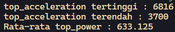

# <p align="center">JOBSHEET IV - BRUTE FORCE DAN DIVIDE CONQUER</p>

<br><br>

<p align="center">
    
</p>

<br><br>

<p align="center">
    Nama : Ahmad Naufal Waskito Aji <br>
    NIM : 2341720080 <br>
    Kelas : TI-1B <br>
    Prodi : D4 Teknik Informatika
</p>

***

## Percobaan 1: Menghitung Nilai Faktorial dengan Algoritma Brute Force dan Divide and Conquer
### **1.1 Kode Percobaan**
``Faktorial.java``
```java
public class Faktorial {
    
    public int nilai;

    int faktorialBF(int n) {
        int fakto = 1;
        for (int i = 1; i <= n; i++) {
            fakto = fakto * i;    
        }
        return fakto;
    }

    int faktorialDC(int n) {
        if(n==1) {
            return 1;
        } else {
            int fakto = n * faktorialDC(n-1);
            return fakto;
        }
    }

}
```

``MainFaktorial.java``
```java
import java.util.Scanner;

public class MainFaktorial {
    public static void main(String[] args) {
        Scanner sc = new Scanner(System.in);
        System.out.println("-----------------------");
        System.out.print("Masukkan jumlah elemen: ");
        int iJml = sc.nextInt();

        Faktorial[] fk = new Faktorial[iJml];
        for (int i = 0; i < iJml; i++) {
            fk[i] = new Faktorial();
            System.out.print("Masukkan nilai data ke-" +(i+1)+": ");
            fk[i].nilai = sc.nextInt();
        }

        System.out.println("HASIL - BRUTE FORCE");
        for (int i = 0; i < iJml; i++) {
            System.out.println("Hasil penghitungan faktorial menggunakan Brute Force adalah " + fk[i].faktorialBF(fk[i].nilai));
        }

        System.out.println("HASIL - DIVIDE AND CONQUER");
        for (int i = 0; i < iJml; i++) {
            System.out.println("Hasil penghitungan faktorial menggunakan Divide and Conquer adalah " + fk[i].faktorialDC(fk[i].nilai));
        }

        sc.close();
    }
}
```

### **1.2 Verifikasi Hasil Percobaan**


### **1.3 Pertanyaan**
1.  Pada base line Algoritma Divide Conquer untuk melakukan pencarian nilai faktorial, jelaskan perbedaan bagian kode pada penggunaan if dan else! <br>
    **Jawaban :**
    ``
    Jika kondisi n==1 bernilai true, maka fungsi faktorialDC akan mengembalikan nilai 1, namun jika tidak terpenuhi akan menghitung faktorial secara rekursif menggunakan n * faktorialDC(n-1).
    ``

2. Apakah memungkinkan perulangan pada method faktorialBF() dirubah selain menggunakan for?Buktikan! <br>
    **Jawaban :**
    ``Memungkinkan``
    ```java
    int faktorialBF(int n) {
        if (n == 0 || n == 1) {
            return 1;
        } else {
            return n * faktorialBF(n - 1);
        }
    }
    ```

3. Jelaskan perbedaan antara fakto *= i; dan int fakto = n * faktorialDC(n-1); ! <br>
    **Jawaban :**
    ``
    fakto *= 1 melakukan perulangan berupa perkalian fakto dengan variabel i hingga variable i sama dengan input n, sedangkan fakto = n * faktorialDC(n-1) melakukan perulangan menggunakan metode rekursif.
    ``

## Percobaan 2: Menghitung Hasil Pangkat dengan Algoritma Brute Force dan Divide and Conquer
### **2.1 Kode Percobaan**
``Pangkat.java``
```java
public class Pangkat {
    
    public int nilai, pangkat;

    int pangkatBF(int a, int n) {
        int hasil = 1;
        for (int i = 0; i < n; i++) {
            hasil *= a;
        }
        return hasil;
    }

    int pangkatDC(int a, int n) {
        if(n==1) {
            return a;
        } else {
            if(n%2==1) {
                return (pangkatDC(a, n/2) * pangkatDC(a, n/2) * a);
            } else {
                return (pangkatDC(a, n/2) * pangkatDC(a, n/2));
            }
        }
    }
}
```

``MainPangkat.java``
```java
import java.util.Scanner;

public class MainPangkat {
    public static void main(String[] args) {
        Scanner sc = new Scanner(System.in);
        System.out.println("-----------------------");
        System.out.print("Masukkan jumlah elemen: ");
        int elemen = sc.nextInt();

        Pangkat[] png = new Pangkat[elemen];
        for (int i = 0; i < elemen; i++) {
            png[i] = new Pangkat();
            System.out.print("Masukkan nilai yang hendak dipangkatkan: ");
            png[i].nilai = sc.nextInt();
            System.out.print("Masukkan nilai pemangkat: ");
            png[i].pangkat = sc.nextInt();
        }

        System.out.println("HASIL - BRUTE FORCE");
        for (int i = 0; i < elemen; i++) {
            System.out.println("Hasil dari "
                                       + png[i].nilai+ " pangkat "
                                       + png[i].pangkat+ " adalah "
                                       + png[i].pangkatBF(png[i].nilai, png[i].pangkat));
        }

        System.out.println("HASIL - DIVIDE AND CONQUER");
        for (int i = 0; i < elemen; i++) {
            System.out.println("Hasil dari "
                                       + png[i].nilai+ " pangkat "
                                       + png[i].pangkat+ " adalah "
                                       + png[i].pangkatDC(png[i].nilai, png[i].pangkat));
        }

        sc.close();
    }
}
```

### **2.2 Verifikasi Hasil Percobaan**


### **2.3 Pertanyaan**
1.  Jelaskan mengenai perbedaan 2 method yang dibuat yaitu PangkatBF() dan PangkatDC()! <br>
    **Jawaban :**
    ``
    PangkatBF() melakukan perulangan iteratif, sedangkan PangkatDC() menggunakan rekursif
    ``

2. Apakah tahap combine sudah termasuk dalam kode tersebut?Tunjukkan! <br>
    **Jawaban :**

    ``
    Tahap kombine sudah ada dalam kode tersebut, ditunjukkan pada
    ``
    ```java
    return (pangkatDC(a, n/2) * pangkatDC(a, n/2) * a);
    return (pangkatDC(a, n/2) * pangkatDC(a, n/2));
    ```
    ``Ditunjukkan pada *``

3. Modifikasi kode program tersebut, anggap proses pengisian atribut dilakukan dengan konstruktor <br>
    **Jawaban :**

    ``Pangkat.java``
    ```java
    Pangkat(int nilai, int pangkat) {
        this.nilai = nilai;
        this.pangkat = pangkat;
    }
    ```

    ``MainPangkat.java``
    ```java
    Pangkat[] png = new Pangkat[elemen];
    for (int i = 0; i < elemen; i++) {
        System.out.print("Masukkan nilai yang hendak dipangkatkan: ");
        int nilai = sc.nextInt();
        System.out.print("Masukkan nilai pemangkat: ");
        int pangkat = sc.nextInt();
        png[i] = new Pangkat(nilai, pangkat);
    }
    ```

4. Tambahkan menu agar salah satu method yang terpilih saja yang akan dijalankan menggunakan switch-case! <br>
    **Jawaban :**

    ``MainPangkat.java``
    ```java
    import java.util.Scanner;

    public class MainPangkat {
        public static void main(String[] args) {
            Scanner sc = new Scanner(System.in);
            System.out.println("-----------------------");
            System.out.print("Masukkan jumlah elemen: ");
            int elemen = sc.nextInt();

            Pangkat[] png = new Pangkat[elemen];
            for (int i = 0; i < elemen; i++) {
                System.out.print("Masukkan nilai yang hendak dipangkatkan: ");
                int nilai = sc.nextInt();
                System.out.print("Masukkan nilai pemangkat: ");
                int pangkat = sc.nextInt();
                png[i] = new Pangkat(nilai, pangkat);
            }
            
            System.out.println("\nMethod yang tersedia");
            System.out.println("1. Brute Force");
            System.out.println("2. Divide and Conquer");
            System.out.print("Masukkan Method Pilihan (1/2): ");

            int metode = 0;
            metode = sc.nextInt();

            switch (metode) {
                case 1:
                    System.out.println("HASIL - BRUTE FORCE");
                    for (int i = 0; i < elemen; i++) {
                        System.out.println("Hasil dari "
                                                + png[i].nilai+ " pangkat "
                                                + png[i].pangkat+ " adalah "
                                                + png[i].pangkatBF(png[i].nilai, png[i].pangkat));
                    }
                    break;
            
                case 2:
                    System.out.println("HASIL - DIVIDE AND CONQUER");
                    for (int i = 0; i < elemen; i++) {
                        System.out.println("Hasil dari "
                                                + png[i].nilai+ " pangkat "
                                                + png[i].pangkat+ " adalah "
                                                + png[i].pangkatDC(png[i].nilai, png[i].pangkat));
                    }
            
                    sc.close();
                    break;

                default:
                    break;
            }
        }
    }
    ```

    
    


## Percobaan 3: Menghitung Sum Array dengan Algoritma Brute Force dan Divide and Conquer
### **3.1 Kode Percobaan**
``Sum.java``
```java
public class Sum {
    
    int elemen;
    double keuntungan[], total;

    Sum(int elemen) {
        this.elemen = elemen;
        this.keuntungan = new double[elemen];
        this.total = 0;
    }

    double totalBF(double arr[]) {
        for(int i=0; i < elemen; i++) {
            total = total + arr[i];
        }
        return total;
    }

    double totalDC(double arr[], int l, int r) {
        if(l==r){
            return arr[l];
        }else if(l < r) {
            int mid = (l+r)/2;
            double lsum = totalDC(arr, l, mid-1);
            double rsum = totalDC(arr, mid+1, r);
            return lsum+rsum+arr[mid];
        }
        return 0;
    }
}
```

``MainSum.java``
```java
import java.util.Scanner;

public class MainSum {
    public static void main(String[] args) {
        Scanner sc = new Scanner(System.in);
        System.out.println("============================");
        System.out.println("Program Menghitung Keuntungan Total (Satuan Juta, Misal 5.9)");
        System.out.print("Masukkan jumlah bulan : ");
        int elm = sc.nextInt();

        Sum sm = new Sum(elm);
        System.out.println("==========================================");
        for (int i = 0; i < sm.elemen; i++) {
            System.out.print("Masukkan untung bulan ke - "+(i+1)+" = ");
            sm.keuntungan[i] = sc.nextDouble();
        }

        System.out.println("====================================================");
        System.out.println("Algoritma Brute Force");
        System.out.println("Total keuntungan perusahaan selama " + sm.elemen + " bulan adalah " +sm.totalBF(sm.keuntungan));
        System.out.println("====================================================");
        System.out.println("Algoritma Divide Conquer");
        System.out.printf("Total keuntungan perusahaan selama %d bulan adalah %.2f", sm.elemen, sm.totalDC(sm.keuntungan, 0, sm.elemen-1));

        sc.close();
    }
}
```

### **3.2 Verifikasi Hasil Percobaan**


### **3.3 Pertanyaan**
1.  Mengapa terdapat formulasi return value berikut?Jelaskan! <br>
    **Jawaban :**
    ``
    Untuk memecah menjadi beberapa bagian
    ``

2. Kenapa dibutuhkan variable mid pada method TotalDC()? <br>
    **Jawaban :**
    ``
    Variabel mid diperlukan dalam fungsi totalDC() untuk rentang array dibagi menjadi dua bagian saat proses rekursif
    ``

3. Program perhitungan keuntungan suatu perusahaan ini hanya untuk satu perusahaan saja. Bagaimana cara menghitung sekaligus keuntungan beberapa bulan untuk beberapa perusahaan.(Setiap perusahaan bisa saja memiliki jumlah bulan berbeda-beda)? Buktikan dengan program! <br>
    **Jawaban :**
    ```java
    import java.util.Scanner;

    public class MainSum {
        public static void main(String[] args) {
            Scanner sc = new Scanner(System.in);
            System.out.println("============================");
            System.out.println("Program Menghitung Keuntungan Total (Satuan Juta, Misal 5.9)");

            System.out.print("Masukkan jumlah perusahaan: ");
            int jml = sc.nextInt();

            for(int i=0; i < jml; i++) {
                System.out.println("\n\nPERUSAHAAN KE "+(i+1));
                System.out.print("Masukkan jumlah bulan : ");
                int elm = sc.nextInt();
        
                Sum sm = new Sum(elm);
                System.out.println("==========================================");
                for (int j = 0; j < sm.elemen; j++) {
                    System.out.print("Masukkan untung bulan ke - "+(j+1)+" = ");
                    sm.keuntungan[j] = sc.nextDouble();
                }
        
                System.out.println("\n\nPENDAPATAN PERUSAHAAN KE "+(i+1));
                System.out.println("====================================================");
                System.out.println("Algoritma Brute Force");
                System.out.println("Total keuntungan perusahaan selama " + sm.elemen + " bulan adalah " +sm.totalBF(sm.keuntungan));
                System.out.println("====================================================");
                System.out.println("Algoritma Divide Conquer");
                System.out.printf("Total keuntungan perusahaan selama %d bulan adalah %.2f", sm.elemen, sm.totalDC(sm.keuntungan, 0, sm.elemen-1));
        
                
            }
            
            sc.close();

        }
    }
    ```


## Latihan Praktikum

### 4.1 Latihan 1
Sebuah showroom memiliki daftar mobil dengan data sesuai tabel di bawah ini <br>
Tentukan: <br>
a) top_acceleration tertinggi menggunakan Divide and Conquer! <br>
b) top_acceleration terendah menggunakan Divide and Conquer! <br>
c) Rata-rata top_power dari seluruh mobil menggunakan Brute Force!

``Mobil.java``
```java
public class Mobil {

    String merek, tipe;
    int tahun, top_acceleration, top_power;

    Mobil(String merek, String tipe, int tahun, int top_acceleration, int top_power) {
        this.merek = merek;
        this.tipe = tipe;
        this.tahun = tahun;
        this.top_acceleration = top_acceleration;
        this.top_power = top_power;
    }

    int getHighestAccel(Mobil arr[], int l, int r) {
        if (l == r) {
            return arr[l].top_acceleration;
        }

        int mid = (r + l) / 2;

        int lHighest = getHighestAccel(arr, l, mid);
        int rHighest = getHighestAccel(arr, mid + 1, r);

        return Math.max(lHighest, rHighest);
    }

    int getLowestAccel(Mobil arr[], int l, int r) {
        if (l == r) {
            return arr[l].top_acceleration;
        }

        int mid = (r + l) / 2;

        int lLowest = getLowestAccel(arr, l, mid);
        int rLowest = getLowestAccel(arr, mid + 1, r);

        return Math.min(lLowest, rLowest);
    }

    double getAvgTopPower(Mobil arr[]) {
        double total = 0;

        for (int i = 0; i < arr.length; i++) {
            total += arr[i].top_power;
        }

        return total / arr.length;
    }

}
```

``MainMobil.java``
```java
public class MainMobil {
    public static void main(String[] args) {
        String[][] arrayMobil = {
            {"BMW", "M2 Coupe", "2016", "6816", "728"},
            {"Ford" , "Fiesta ST", "2014", "3921", "575"},
            {"Nissan", "370Z", "2009", "4360", "657"},
            {"Subaru", "BRZ", "2014", "4058", "609"},
            {"Subaru", "Impreza WRX STI", "2013", "6255", "703"},
            {"Toyota", "AE86 Trueno", "1986", "3700", "553"},
            {"Toyota", "86/GT86", "2014", "4180", "609"},
            {"Volkswagen", "Golf GTI", "2014", "4180", "631"},
        };
        
        Mobil mobil[] = new Mobil[8];

        for (int i = 0; i < mobil.length; i++) {
            mobil[i] = new Mobil(arrayMobil[i][0], arrayMobil[i][1], Integer.parseInt(arrayMobil[i][2]), Integer.parseInt(arrayMobil[i][3]),
                    Integer.parseInt(arrayMobil[i][4]));
        }

        System.out.println("top_acceleration tertinggi : " + mobil[0].getHighestAccel(mobil, 0, mobil.length - 1));
        System.out.println("top_acceleration terendah : " + mobil[0].getLowestAccel(mobil, 0, mobil.length - 1));
        System.out.println("Rata-rata top_power : " + mobil[0].getAvgTopPower(mobil));

    }
}
```


