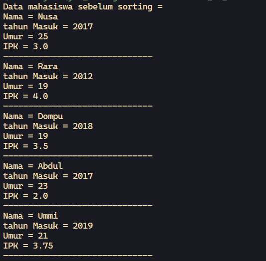
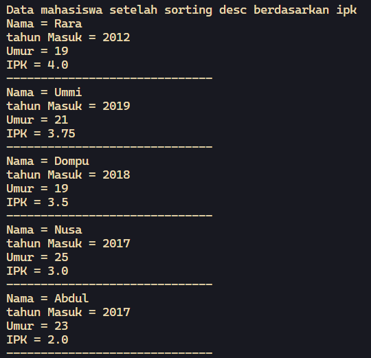
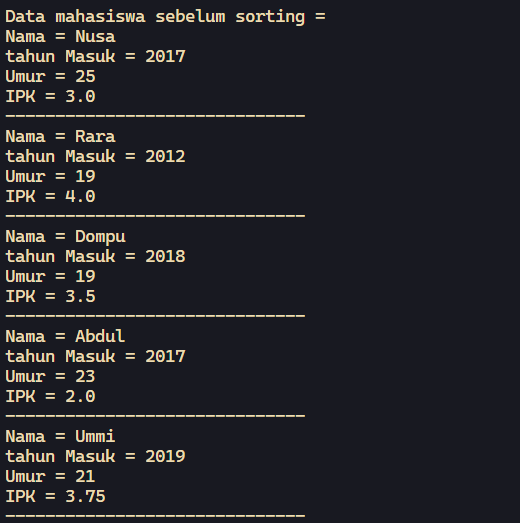
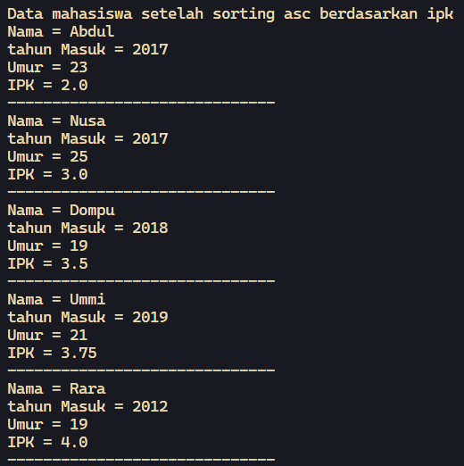
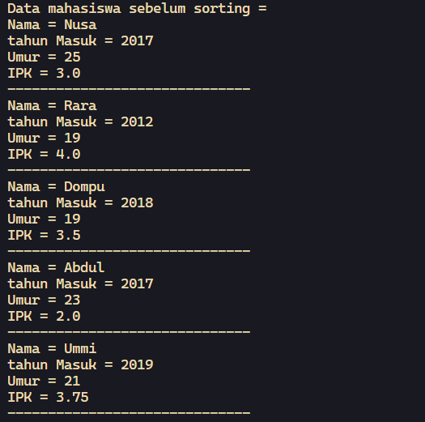
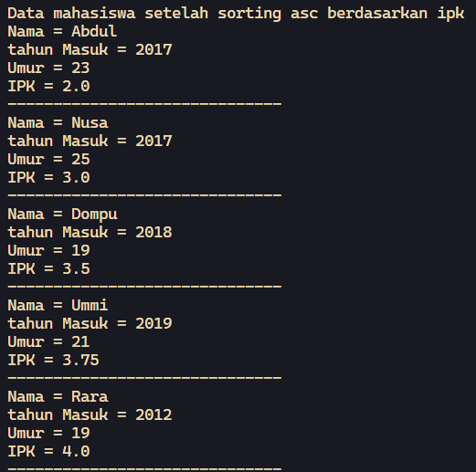
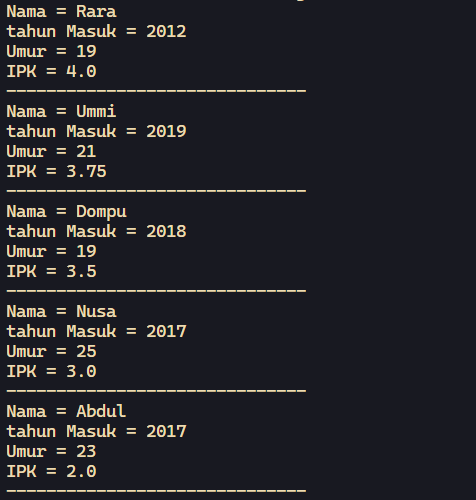
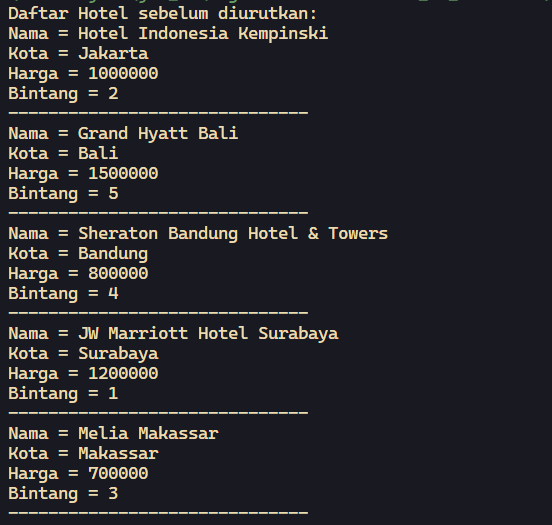
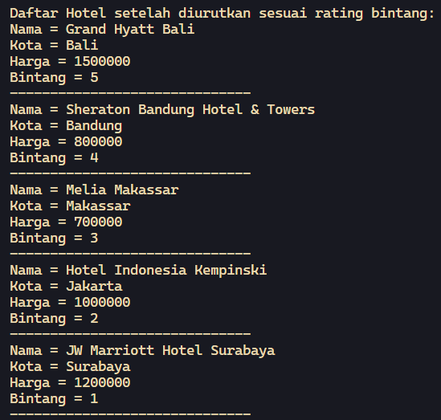
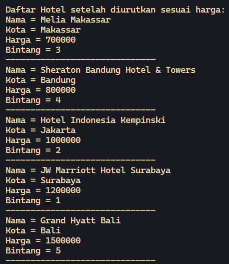

# <p align="center">JOBSHEET V - SORTING (BUBBLE, SELECTION, DAN INSERTION SORT)</p>

<br><br>

<p align="center">
    
</p>

<br><br>

<p align="center">
    Nama : Ahmad Naufal Waskito Aji <br>
    NIM : 2341720080 <br>
    Kelas : TI-1B <br>
    Prodi : D4 Teknik Informatika
</p>

***

## Percobaan 1: Mengurutkan Data Mahasiswa Berdasarkan IPK Menggunakan Bubble Sort
### **1.1 Kode Percobaan**
``Mahasiswa.java``
```java
public class Mahasiswa {
    String nama;
    int thnMasuk, umur;
    double ipk;

    Mahasiswa(String n, int t, int u, double i) {
        nama = n;
        thnMasuk = t;
        umur = u;
        ipk = i;
    }

    public void tampil() {
        System.out.println("Nama = "+nama);
        System.out.println("tahun Masuk = "+thnMasuk);
        System.out.println("Umur = "+umur);
        System.out.println("IPK = "+ipk);
    }
}

```

``DaftarMahasiswaBerprestasi.java``
```java
public class DaftarMahasiswaBerprestasi {
    Mahasiswa listMhs[] = new Mahasiswa[5];
    int idx;

    void tambah(Mahasiswa m){
        if(idx<listMhs.length){
            listMhs[idx] = m;
            idx++;
        } else {
            System.out.println("Data sudah penuh!!");
        }
    }

    void tampil(){
        for(Mahasiswa m : listMhs) {
            m.tampil();
            System.out.println("------------------------------");
        }
    }

    void bubbleSort(){
        for(int i=0; i<listMhs.length-1; i++){
            for(int j=1; j<listMhs.length-i; j++){
                if(listMhs[j].ipk < listMhs[j-1].ipk){
                    Mahasiswa tmp = listMhs[j];
                    listMhs[j] = listMhs[j-1];
                    listMhs[j-1] = tmp;
                }
            }
        }
    }
}
```

``Main.java``
```java
public class Main {
    public static void main(String[] args) {
        DaftarMahasiswaBerprestasi list = new DaftarMahasiswaBerprestasi();
        Mahasiswa m1 = new Mahasiswa("Nusa", 2017, 25, 3);
        Mahasiswa m2 = new Mahasiswa("Rara", 2012, 19, 3);
        Mahasiswa m3 = new Mahasiswa("Dompu", 2018, 19, 3.5);
        Mahasiswa m4 = new Mahasiswa("Abdul", 2017, 23, 2);
        Mahasiswa m5 = new Mahasiswa("Ummi", 2019, 21, 3.75);

        list.tambah(m1);
        list.tambah(m2);
        list.tambah(m3);
        list.tambah(m4);
        list.tambah(m5);

        System.out.println("Data mahasiswa sebelum sorting = ");
        list.tampil();

        System.out.println("Data mahasiswa setelah sorting desc berdasarkan ipk");
        list.bubbleSort();
        list.tampil();
    }
}
```

### **1.2 Verifikasi Hasil Percobaan**




### **1.3 Pertanyaan**
1.  Terdapat di method apakah proses bubble sort? <br>
    **Jawaban :**
    ``
    Proses pengurutan menggunakan algoritma bubble sort terdapat dalam method bubbleSort().
    ``

2. Di dalam method bubbleSort(), terdapat baris program seperti di bawah ini: Untuk apakah proses tersebut? <br>
    **Jawaban :**
    ``
    Jika listMhs[j].ipk lebih besar dari listMhs[j-1].ipk, maka pertukaran dilakukan.Variabel tmp digunakan untuk menyimpan nilai Mahasiswa ke-j sementara sebelum pertukaran dilakukan.Setelahnya, nilai Mahasiswa j diganti dengan nilai Mahasiswa (j-1), dan nilai Mahasiswa (j-1) diganti dengan nilai yang disimpan di variabel tmp.
    ``

3. Perhatikan perulangan di dalam bubbleSort() di bawah ini: <br>
    a. Apakah perbedaan antara kegunaan perulangan i dan perulangan j? <br> **Jawaban :**
    ``
    Setiap iterasi perulangan i mengatur seberapa jauh elemen terbesar sudah berada di posisi yang benar. Sedangkan perulangan j digunakan untuk membandingkan pasangan-pasangan elemen dalam array dan melakukan pertukaran.
    ``

    b. Mengapa syarat dari perulangan i adalah i<listMhs.length-1? <br> **Jawaban :**
    ``
    Karena setelah listMhs.length-1 iterasi dari perulangan i, elemen terbesar sudah pasti telah mencapai posisi sehingga tidak perlu lagi melakukan iterasi selanjutnya.
    ``

    c. Mengapa syarat dari perulangan j adalah j<listMhs.length-i? <br> **Jawaban :**
    ``
    Syarat dari perulangan j adalah j<listMhs.length-i karena pada setiap iterasi i, elemen terbesar sudah dipastikan berada di posisi yang benar pada iterasi sebelumnya.
    ``

    d. Jika banyak data di dalam listMhs adalah 50, maka berapakali perulangan i akan berlangsung? Dan ada berapa Tahap bubble sort yang ditempuh? ?<br> **Jawaban :**
    ``
    Peulangan i dan j akan berlangsung sebanyak 49 kali.
    ``

## Percobaan 2: Mengurutkan Data Mahasiswa Berdasarkan IPK Menggunakan Selection Sort
### **2.1 Kode Percobaan**
``DaftarMahasiwaBerprestasi.java``
```java
    void selectionSort(){
        for(int i=0; i<listMhs.length-1; i++){
            int idxMin = i;
            for(int j=i+1; j<listMhs.length; j++){
                if(listMhs[j].ipk < listMhs[idxMin].ipk){
                    idxMin = j;
                }
            }

            Mahasiswa tmp = listMhs[idxMin];
            listMhs[idxMin] = listMhs[i];
            listMhs[i] = tmp;
        }
    }
```

``Main.java``
```java
    System.out.println("Data mahasiswa setelah sorting asc berdasarkan ipk");
    list.selectionSort();
    list.tampil();
```

### **2.2 Verifikasi Hasil Percobaan**




### **2.3 Pertanyaan**
1.  Di dalam method selection sort, terdapat baris program seperti di bawah ini: Untuk apakah proses tersebut, jelaskan! <br>
    **Jawaban :**
    ``
    Proses ini bertujuan untuk menemukan elemen terkecil dari bagian array yang belum diurutkan, kemudian menukarnya dengan elemen pertama dari bagian yang belum diurutkan.
    ``


## Percobaan 3: Mengurutkan Data Mahasiswa Berdasarkan IPK Menggunakan Insertion Sort
### **3.1 Kode Percobaan**
``DaftarMahasiswaBerprestasi.java``
```java
    void insertionSort() {
        for (int i = 1; i < listMhs.length; i++){
            Mahasiswa temp = listMhs[i];
            int j = i;
            while (j > 0 && listMhs[j-1].ipk > temp.ipk) {
                listMhs[j] = listMhs[j-1];
                j--;
            }
            listMhs[j] = temp;
        }
    }
```

``Main.java``
```java
    System.out.println("Data mahasiswa setelah sorting asc berdasarkan ipk");
    list.insertionSort();
    list.tampil();
```

### **3.2 Verifikasi Hasil Percobaan**




### **3.3 Pertanyaan**
1.  Ubahlah fungsi pada InsertionSort sehingga fungsi ini dapat melaksanakan proses sorting dengan cara descending. <br>
    **Jawaban :**
    ``DaftarMahasiswaBerprestasi.java``
    ```java
    void insertionSort() {
        for (int i = 1; i < listMhs.length; i++){
            Mahasiswa temp = listMhs[i];
            int j = i;
            while (j > 0 && listMhs[j-1].ipk < temp.ipk) {
                listMhs[j] = listMhs[j-1];
                j--;
            }
            listMhs[j] = temp;
        }
    }
    ```

    


## Latihan Praktikum

### 4.1 Latihan 1
Sebuah platform travel yang menyediakan layanan pemesanan kebutuhan travelling sedang mengembangkan backend untuk sistem pemesanan/reservasi akomodasi (penginapan), salah satu fiturnya adalah menampilkan daftar penginapan yang tersedia berdasarkan pilihan filter
yang diinginkan user. Daftar penginapan ini harus dapat disorting berdasarkan

1. Harga dimulai dari harga termurah ke harga tertinggi.
2. Rating bintang penginapan dari bintang tertinggi (5) ke terendah (1)

Buatlah proses sorting data untuk kedua filter tersebut dengan menggunakan algoritma 

``HotelService.java``
```java
public class HotelService {
    Hotel rooms;

    Hotel listHotel[] = new Hotel[5];
    int idx;

    void tambah(Hotel H){
        if(idx<listHotel.length){
            listHotel[idx] = H;
            idx++;
        } else {
            System.out.println("Data sudah penuh!!");
        }
    }

    void tampilAll(){
        for(Hotel H : listHotel) {
            System.out.println("Nama = "+H.nama);
            System.out.println("Kota = "+H.kota);
            System.out.println("Harga = "+H.harga);
            System.out.println("Bintang = "+H.bintang);
            System.out.println("------------------------------");
        }
    }

    void bubbleSortHarga(){
        for(int i=0; i<listHotel.length-1; i++){
            for(int j=1; j<listHotel.length-i; j++){
                if(listHotel[j].harga < listHotel[j-1].harga){
                    Hotel tmp = listHotel[j];
                    listHotel[j] = listHotel[j-1];
                    listHotel[j-1] = tmp;
                }
            }
        }
    }

    void selectionSortHarga(){
        for(int i=0; i<listHotel.length-1; i++){
            int idxMin = i;
            for(int j=i+1; j<listHotel.length; j++){
                if(listHotel[j].harga < listHotel[idxMin].harga){
                    idxMin = j;
                }
            }

            Hotel tmp = listHotel[idxMin];
            listHotel[idxMin] = listHotel[i];
            listHotel[i] = tmp;
        }
    }

    void bubbleSortBintang(){
        for(int i=0; i<listHotel.length-1; i++){
            for(int j=1; j<listHotel.length-i; j++){
                if(listHotel[j].bintang > listHotel[j-1].bintang){
                    Hotel tmp = listHotel[j];
                    listHotel[j] = listHotel[j-1];
                    listHotel[j-1] = tmp;
                }
            }
        }
    }

    void selectionSortBintang(){
        for(int i=0; i<listHotel.length-1; i++){
            int idxMax = i;
            for(int j=i+1; j<listHotel.length; j++){
                if(listHotel[j].bintang > listHotel[idxMax].bintang){
                    idxMax = j;
                }
            }

            Hotel tmp = listHotel[idxMax];
            listHotel[idxMax] = listHotel[i];
            listHotel[i] = tmp;
        }
    }

}
```

``Hotel.java``
```java
public class Hotel {
    String nama, kota;
    int harga;
    byte bintang;

    Hotel(String n, String k, int h, byte b){
        nama = n;
        kota = k;
        harga = h;
        bintang = b;
    }

}
```

``MainHotel.java``
```java
public class MainHotel {
    public static void main(String[] args) {
        String[][] arrayHotel = {
            {"Hotel Indonesia Kempinski", "Jakarta", "1000000", "2"},
            {"Grand Hyatt Bali", "Bali", "1500000", "5"},
            {"Sheraton Bandung Hotel & Towers", "Bandung", "800000", "4"},
            {"JW Marriott Hotel Surabaya", "Surabaya", "1200000", "1"},
            {"Melia Makassar", "Makassar", "700000", "3"}
        };

        Hotel hotel[] = new Hotel[5];

        for (int i = 0; i < hotel.length; i++) {
            hotel[i] = new Hotel(arrayHotel[i][0], arrayHotel[i][1], Integer.parseInt(arrayHotel[i][2]), Byte.parseByte(arrayHotel[i][3]));
        }
        
        HotelService hotelService = new HotelService();

        for (Hotel h : hotel) {
            hotelService.tambah(h);
        }

        System.out.println("Daftar Hotel sebelum diurutkan:");
        hotelService.tampilAll();

        System.out.println("Daftar Hotel setelah diurutkan sesuai rating bintang:");
        hotelService.selectionSortBintang();
        hotelService.tampilAll();

        System.out.println("Daftar Hotel setelah diurutkan sesuai harga:");
        hotelService.bubbleSortHarga();
        hotelService.tampilAll();

    }
}
```





