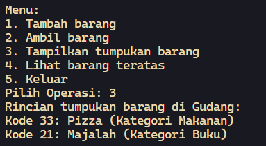

# <p align="center">JOBSHEET VII - STACK</p>

<br><br>

<p align="center">
    
</p>

<br><br>

<p align="center">
    Nama : Ahmad Naufal Waskito Aji <br>
    NIM : 2341720080 <br>
    Kelas : TI-1B <br>
    Prodi : D4 Teknik Informatika
</p>

***

## Percobaan 1: Penyimpanan Tumpukan Barang dalam Gudang
### **1.1 Kode Percobaan**
``Barang04.java``
```java
public class Barang04 {
    int kode;
    String nama, kategori;

    Barang04(int kode, String nama, String kategori) {
        this.kode = kode;
        this.nama = nama;
        this.kategori = kategori;
    }
    
}
```

``Gudang04.java``
```java
public class Gudang04 {
    Barang04[] tumpukan;
    int size;
    int top;

    public Gudang04(int kapasitas) {
        size = kapasitas;
        tumpukan = new Barang04[size];
        top = -1;
    }

    public boolean cekKosong() {
        if (top == -1) {
            return true;
        } else {
            return false;
        }
    }

    public boolean cekPenuh() {
        if (top == size - 1) {
            return true;
        } else {
            return false;
        }
    }

    public void tambahBarang(Barang04 brg) {
        if (!cekPenuh()) {
            top++;
            tumpukan[top] = brg;
            System.out.println("Barang " + brg.nama + " berhasil ditambahkan ke Gudang");
        } else {
            System.out.println("Gagal! Tumpukan barang di Gudang sudah penuh");
        }
    }

    public Barang04 ambilBarang() {
        if (!cekKosong()) {
            Barang04 delete = tumpukan[top];
            top--;
            System.out.println("Barang " + delete.nama + " diambil dari Gudang.");
            return delete;
        } else {
            System.out.println("Tumpukan barang kosong.");
            return null;
        }
    }

    public Barang04 lihatBarangTeratas() {
        if (!cekKosong()) {
            Barang04 barangTeratas = tumpukan[top];
            System.out.println("Barang teratas: " + barangTeratas.nama);
            return barangTeratas;
        } else {
            System.out.println("Tumpukan barang kosong.");
            return null;
        }
    }

    public void tampilkanBarang() {
        if (!cekKosong()) {
            System.out.println("Rincian tumpukan barang di Gudang:");
            for (int i=top; i>=0; i--) {
                System.out.printf("Kode %d: %s (Kategori %s)\n", tumpukan[i].kode,
                        tumpukan[i].nama, tumpukan[i].kategori);
            }
        } else {
            System.out.println("Tumpukan barang kosong.");
        }
    }
}
```

``Utama04.java``
```java
import java.util.Scanner;

public class Utama04 {
    public static void main(String[] args) {
        Gudang04 gudang = new Gudang04(7);
        Scanner scanner = new Scanner(System.in);

        while (true) {
            System.out.println("\nMenu:");
            System.out.println("1. Tambah barang");
            System.out.println("2. Ambil barang");
            System.out.println("3. Tampilkan tumpukan barang");
            System.out.println("4. Keluar");
            System.out.print("Pilih Operasi: ");
            int pilihan = scanner.nextInt();
            scanner.nextLine();
            
            switch (pilihan) {
                case 1:
                    System.out.print("Masukkan kode barang: ");
                    int kode = scanner.nextInt();
                    scanner.nextLine();
                    System.out.print("Masukkan nama barang: ");
                    String nama = scanner.nextLine();
                    System.out.print("Masukkan nama kategori: ");
                    String kategori = scanner.nextLine();
                    Barang04 barangBaru = new Barang04(kode, nama, kategori);
                    gudang.tambahBarang(barangBaru);
                    break;

                case 2:
                    gudang.ambilBarang();
                    break;

                case 3:
                    gudang.tampilkanBarang();
                    break;

                case 4:
                    System.exit(0);
                    break;
            
                default:
                    System.out.println("Pilihan tidak valid. Silakan coba lagi");;
            }
        }
    }
}
```

### **1.2 Verifikasi Hasil Percobaan**





### **1.3 Pertanyaan**
1. Lakukan perbaikan pada kode program, sehingga keluaran yang dihasilkan sama dengan verifikasi hasil percobaan! Bagian mana saja yang perlu diperbaiki? <br>
    **Jawaban :**
    ``
    Terdapat kesalahan pada kondisi perulangan pada method tampilkanBarang(), seharusnya for(int i=top; i>=0; i--), kemudian ada beberapa kesalahan ataupun kurangnya kode pada method lihatBarangTeratas() seharusnya bukan !isEmpty() tetapi !cekKosong(), dan pada case 4 di Utama04.java ditambahkan System.exit(0); untuk keluar dari program.
    ``

2. Berapa banyak data barang yang dapat ditampung di dalam tumpukan? Tunjukkan potongan kode programnya! <br>
    **Jawaban :**
    
    ``Banyak data yang dapat ditampung berjumlah 7``

    ```java
    Gudang04 gudang = new Gudang04(7);
    ```

3. Mengapa perlu pengecekan kondisi !cekKosong() pada method tampilkanBarang? Kalau kondisi tersebut dihapus, apa dampaknya? <br> 
    **Jawaban :**
    ``
    Pengecekan kondisi tersebut diperlukan agar jika data barang kosong, maka proses perulangan untuk menampilkan data barang tidak berjalan, jika kondisi tersebut dihapus, maka program masih dapat berjalan, namun tidak ada data barang yang ditampilkan.
    ``

    

4. Modifikasi kode program pada class Utama sehingga pengguna juga dapat memilih operasi lihat barang teratas, serta dapat secara bebas menentukan kapasitas gudang! <br> 
    **Jawaban :**
    ``Menentukan kapasitas gudang``
    ```java
        System.out.print("Masukkan Kapasitas Gudang: ");
        Gudang04 gudang = new Gudang04(scanner.nextInt());
    ```
    

    ``Memilih operasi lihat barang teratas``
    ```java
        case 4:
            gudang.lihatBarangTeratas();
            break;
    ```
    

## Percobaan 2: Konversi Kode Barang ke Biner
### **2.1 Kode Percobaan**
``Gudang04.java``
```java
    public String konversiDesimalKeBiner(int kode) {
        StackKonversi04 stack = new StackKonversi04();
        while (kode > 0) {
            int sisa = kode % 2;
            stack.push(sisa);
            kode = kode / 2;
        }
        String biner = new String();
        while (!stack.isEmpty()) {
            biner += stack.pop();
        }
        return biner;
    }
```

``StckKonversi04.java``
```java
public class StackKonversi04 {
    int size;
    int[] tumpukanBiner;
    int top;
   
    public StackKonversi04() {
        this.size = 32;
        tumpukanBiner = new int[size];
        top = -1;
    }

    public boolean isEmpty() {
        return top == -1;
    }

    public boolean isFull() {
        return top == size - 1;
    }

    public void push(int data) {
        if (isFull()) {
            System.out.println("Stack Penuh");            
        } else {
            top++;
            tumpukanBiner[top] = data;
        }
    }

    public int pop() {
        if (isEmpty()) {
            System.out.println("Stack kosong");  
            return -1;        
        } else {
            int data = tumpukanBiner[top];
            top--;
            return data;
        }
    }
}
```

### **2.2 Verifikasi Hasil Percobaan**


### **2.3 Pertanyaan**
1.  Pada method konversiDesimalKeBiner, ubah kondisi perulangan menjadi while (kode != 0), bagaimana hasilnya? Jelaskan alasannya! <br>
    **Jawaban :**
    ``
        Hasilnya program tetap berjalan, dalam kondisi while (kode > 0) proses konversi akan berhenti ketika kode menjadi 0, ketika menggunakan kondisi while (kode != 0) proses konversi berlangsung hingga semua digit dikonversi;
    ``

    

2.  Jelaskan alur kerja dari method konversiDesimalKeBiner! <br>
    **Jawaban :**
    ``
        Stack digunakan untuk menyimpan sisa-sisa pembagian, jika kode lebih besar dari 0, maka sisa pembagian kode dengan 2 dihitung dan disimpan dalam varible sisa dan dipus ke dalam stack, kode diperbarui dengan kode / 2 dan proses diulangi hingga kode menjadi 0. 

        Selama stack tidak kosong, maka akan mengambil elemen teratas dan ditambahkan ke biner, kemudian melakukan return nilai biner.
    ``

## Percobaan 3: Konversi Notasi Infix ke Postfix
### **3.1 Kode Percobaan**
``Postfix04.java``
```java
public class Postfix04 {
    int n, top;
    char[] stack;

    public Postfix04(int total) {
        n = total;
        top = -1;
        stack = new char[n];
        push('(');
    }

    public void push(char c) {
        top++;
        stack[top] = c;
    }

    public char pop() {
        char item = stack[top];
        top--;
        return item;
    }

    public boolean IsOperand(char c) {
        if ((c >= 'A' && c <= 'Z') || (c >= 'a' && c <= 'z') ||
                (c >= '0' && c <= '9') || c == ' ' || c == '.') {
            return true;
        } else {
            return false;
        }
    }

    public boolean IsOperator(char c) {
        if (c == '^' || c == '%' || c == '/' || c == '*' || c == '-' || c == '+') {
            return true;
        } else {
            return false;
        }
    }

    public int derajat(char c) {
        switch (c) {
            case '^':
                return 3;
            case '%':
                return 2;
            case '/':
                return 2;
            case '*':
                return 2;
            case '-':
                return 1;
            case '+':
                return 1;
            default:
                return 0;
        }
    }

    public String konversi(String Q) {
        String P = "";
        char c;
        for (int i=0; i<n; i++) {
            c = Q.charAt(i);
            if (IsOperand(c)) {
                P = P + c;
            }
            if (c == '(') {
                push(c);
            }
            if (c == ')') {
                while (stack[top] != '(') {
                    P = P + pop();
                }
                pop();
            }
            if (IsOperator(c)) {
                while (derajat(stack[top]) >= derajat(c)) {
                    P = P + pop();
                }
                push(c);
            }
        }
        return P;
    }
    
}
```

``PostfixMain04.java``
```java
import java.util.Scanner;

public class PostfixMain04 {
    public static void main(String[] args) {
        Scanner sc = new Scanner(System.in);
        String P, Q;
        System.out.println("Masukkan ekspresi matematika (infix): ");
        Q = sc.nextLine();
        Q = Q.trim();
        Q = Q + ")";

        int total = Q.length();

        Postfix04 post = new Postfix04(total);
        P = post.konversi(Q);
        System.out.println("Postfix: " + P);
    }
}
```

### **3.2 Verifikasi Hasil Percobaan**


### **3.3 Pertanyaan**
1.  Pada method derajat, mengapa return value beberapa case bernilai sama? Apabila return value diubah dengan nilai berbeda-beda setiap case-nya, apa yang terjadi? <br>
    **Jawaban :**
    ``
        Return value dapat bernilai sama, karena return value pada case tersebut digunakan sebagai urutan derajat operator aritmatika, jika return valuenya diubah maka maka method ini akan mengembalikan tingkat prioritas yang berbeda untuk setiap operator.
    ``

2.  Jelaskan alur kerja method konversi! <br>
    **Jawaban :**
    ``
        Inisialisasi string kosong P sebagai hasil konversi, melakukan iterasi setiap karakter dalam string Q, serta menyimpan karakter saat ini dalam variabel c. Jika karakter c adalah operand, maka karakter tersebut langsung ditambahkan ke string P.Jika karakter c adalah ('('), maka tanda kurung tersebut dimasukkan ke dalam stack. Jika karakter c adalah tanda kurung tutup (')'), maka dilakukan pengosongan stack sampai menemukan tanda kurung buka ('(') serta menambahkan setiap operator yang dihapus ke dalam string P.Jika karakter c adalah operator, maka dilakukan pengecekan pada stack untuk memastikan urutan prioritas operator. Jika operator di stack memiliki prioritas yang lebih tinggi atau sama, maka operator tersebut dihapus dari stack dan ditambahkan ke dalam string P. Kemudian P akan dikembalikan sebagai return value.
    ``

3.  Pada method konversi, apa fungsi dari potongan kode berikut? <br>
    ```java
        c = Q.charAt(i);
    ```
    **Jawaban :**
    ``
        Menyimpan karakter saat ini dalam String Q dalam variabel c. 
    ``


## Latihan Praktikum

### 4.1 Latihan Praktikum
Perhatikan dan gunakan kembali kode program pada Percobaan 1. Tambahkan dua method berikut pada class Gudang:

- Method lihatBarangTerbawah digunakan untuk mengecek barang pada tumpukan terbawah
```java
    public Barang04 lihatBarangTerbawah() {
        if (!cekKosong()) {
            Barang04 barangTerbawah = tumpukan[0];
            System.out.println("Barang teratas: " + barangTerbawah.nama);
            return barangTerbawah;
        } else {
            System.out.println("Tumpukan barang kosong.");
            return null;
        }
    }
```

### **4.1.1 Verifikasi Hasil Percobaan**


- Method cariBarang digunakan untuk mencari ada atau tidaknya barang berdasarkan kode barangnya atau nama barangnya
```java
    public void cariBarang(String key) {
        boolean ditemukan = false;

        for (int j=0; j<=top; j++) {
            try {
                int kodeKey = Integer.parseInt(key);
                if (tumpukan[j].nama.equalsIgnoreCase(key) || tumpukan[j].kode == kodeKey) {
                    System.out.println("Barang ditemukan!");
                    ditemukan = true;
                    System.out.println("Kode Barang: "+ tumpukan[j].kode);
                    System.out.println("nama Barang: "+ tumpukan[j].nama);
                    System.out.println("Kategori Barang: "+ tumpukan[j].kategori);
                    return;
                }
            } catch (NumberFormatException e) {
                System.out.println("");
                break;
            }
        }

        for (int j=0; j<=top; j++) {
            if (tumpukan[j].nama.equalsIgnoreCase(key)){
                System.out.println("Barang ditemukan!");
                System.out.println("Kode Barang: "+ tumpukan[j].kode);
                System.out.println("nama Barang: "+ tumpukan[j].nama);
                System.out.println("Kategori Barang: "+ tumpukan[j].kategori);
                return;
            } else {
                System.out.println("");
            }
        }

        if (!ditemukan) {
            System.out.println("Barang tidak ditemukan!");
        }
        
    }
```

### **4.1.2 Verifikasi Hasil Percobaan**


