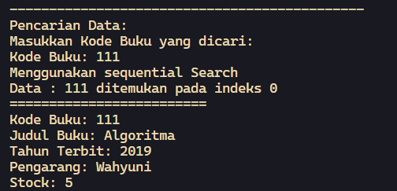

# <p align="center">JOBSHEET VI - SEARCHING</p>

<br><br>

<p align="center">
    
</p>

<br><br>

<p align="center">
    Nama : Ahmad Naufal Waskito Aji <br>
    NIM : 2341720080 <br>
    Kelas : TI-1B <br>
    Prodi : D4 Teknik Informatika
</p>

***

## Percobaan 1: Searching / Pencarian Menggunakan Agoritma Sequential Search
### **1.1 Kode Percobaan**
``Buku04.java``
```java
package Pertemuan7;
public class Buku04 {
    int kodeBuku;
    String judulBuku;
    int tahunTerbit;
    String pengarang;
    int stock;

    public Buku04(int kodeBuku, String judulBuku, int tahunTerbit, String pengarang, int stock) {
        this.kodeBuku = kodeBuku;
        this.judulBuku = judulBuku;
        this.tahunTerbit = tahunTerbit;
        this.pengarang = pengarang;
        this.stock = stock;
    }

    public void tampilDataBuku() {
        System.out.println("=========================");
        System.out.println("Kode Buku: "+kodeBuku);
        System.out.println("Judul Buku: "+judulBuku);
        System.out.println("Tahun Terbit: "+tahunTerbit);
        System.out.println("Pengarang: "+pengarang);
        System.out.println("Stock: "+stock);
    }

}
```

``PencarianBuku04.java``
```java
package Pertemuan7;

public class PencarianBuku04 {
    Buku04 listBk[] = new Buku04[5];
    int idx;
    
    void tambah(Buku04 m) {
        if (idx < listBk.length) {
            listBk[idx] = m;
            idx++;
        } else {
            System.out.println("Data sudah penuh!");
        }
    }

    void tampil() {
        for (Buku04 m : listBk) {
            m.tampilDataBuku();
        }
    }

    public int FindSeqSearch(int cari) {
        int posisi = -1;
        for (int j=0; j<listBk.length; j++) {
            if (listBk[j].kodeBuku==cari){
                posisi = j;
                break;
            }
        }
        return posisi;
    }

    public void TampilPosisi(int x, int pos){
        if(pos!=-1) {
            System.out.println("Data : " + x + " ditemukan pada indeks " + pos);
        } else {
            System.out.println("Data: " + x + " tidak ditemukan");
        }
    }

    public void TampilData(int x, int pos) {
        if(pos!=-1) {
            System.out.println("=========================");
            System.out.println("Kode Buku: "+x);
            System.out.println("Judul Buku: "+listBk[pos].judulBuku);
            System.out.println("Tahun Terbit: "+listBk[pos].tahunTerbit);
            System.out.println("Pengarang: "+listBk[pos].pengarang);
            System.out.println("Stock: "+listBk[pos].stock);
        } else {
            System.out.println("Data " + x + " tidak ditemukan");
        }
    }
}
```

``BukuMain04.java``
```java
package Pertemuan7;
import java.util.Scanner;

public class BukuMain04 {
    public static void main(String[] args) {
        Scanner s = new Scanner(System.in);
        Scanner s1 = new Scanner(System.in);
    
        PencarianBuku04 data = new PencarianBuku04();
        int jumBuku = 5;
    
        System.out.println("---------------------------------------------"); 
        System.out.println("Masukkan data Buku secara Urut dari KodeBuku Terkecil : ");
        for (int i=0; i<jumBuku; i++) {
            System.out.println("-------------------");
            System.out.print("Kode Buku \t: ");
            int kodeBuku = s.nextInt();
            System.out.print("Judul Buku \t: ");
            String judulBuku = s1.nextLine();
            System.out.print("Tahun Terbit \t: ");
            int tahunTerbit = s.nextInt();
            System.out.print("Pengarang: \t: ");
            String pengarang = s1.nextLine();
            System.out.print("Stock \t\t: ");
            int stock = s.nextInt();

            Buku04 m = new Buku04(kodeBuku, judulBuku, tahunTerbit, pengarang, stock);
            data.tambah(m);
        }
        System.out.println("---------------------------------------------"); 
        System.out.println("Data keseluruhan Mahasiswa: ");  
        data.tampil();

        System.out.println("---------------------------------------------"); 
        System.out.println("---------------------------------------------"); 
        System.out.println("Pencarian Data: ");
        System.out.println("Masukkan Kode Buku yang dicari: ");
        System.out.print("Kode Buku: ");
        int cari = s.nextInt();
        System.out.println("Menggunakan sequential Search");
        int posisi = data.FindSeqSearch(cari);
        data.TampilPosisi(cari, posisi);
        data.TampilData(cari, posisi);
    }
}
```

### **1.2 Verifikasi Hasil Percobaan**





### **1.3 Pertanyaan**
1.  Jelaskan fungsi break yang ada pada method FindSeqSearch! <br>
    **Jawaban :**
    ``
    Fungsi break pada method FindSeqSearch adalah untuk menghentikan pencarian apabila data yang dicari sudah ditemukan.
    ``

2. Jika Data Kode Buku yang dimasukkan tidak terurut dari kecil ke besar. Apakah program masih dapat berjalan? Apakah hasil yang dikeluarkan benar? Tunjukkan hasil screenshoot untuk bukti dengan kode Buku yang acak. Jelaskan Mengapa hal tersebut bisa terjadi? <br>
    **Jawaban :**
    
    

    ``
    Berdasarkan percobaan yang telah dilakukan, program masih dapat berjalan dan masih mengeluarkan nilai yang benar. hal ini dapat terjadi karena Sequential Search tidak bergantung pada urutan data, namun proses pencarian akan dilakukan mulai dari index 0 hingga data yang diingin dicari ditemukan
    ``

3. Buat method baru dengan nama FindBuku menggunakan konsep sequential search dengan tipe method dari FindBuku adalah BukuNoAbsen. Sehingga Anda bisa memanggil method tersebut pada class BukuMain seperti gambar berikut : <br> 
    **Jawaban :**
    ``
    ?
    ``

## Percobaan 2: Searching / Pencarian Menggunakan Binary Search
### **2.1 Kode Percobaan**
``PencarianBuku04.java``
```java
    public int FindBinarySearch(int cari, int left, int right) {
        int mid;
        if (right >= left) {
            mid = left + (right - left) / 2;
            if (cari == listBk[mid].kodeBuku) {
                return (mid);
            } else if (listBk[mid].kodeBuku > cari) {
                return FindBinarySearch(cari, left, mid - 1);
            } else {
                return FindBinarySearch(cari, mid + 1, right);
            }
        }
        return -1;
    }
```

``BukuMain04.java``
```java
    System.out.println("---------------------------------------------");
    System.out.println("Menggunakan Binary Search");
    posisi = data.FindBinarySearch(cari, 0, jumBuku - 1);
    data.TampilPosisi(cari, posisi);
    data.TampilData(cari, posisi);
```

### **2.2 Verifikasi Hasil Percobaan**


### **2.3 Pertanyaan**
1.  Tunjukkan pada kode program yang mana proses divide dijalankan! <br>
    **Jawaban :**
    ```java
        mid = left + (right - left) / 2;
    ```

2.  Tunjukkan pada kode program yang mana proses conquer dijalankan! <br>
    **Jawaban :**
    ```java
        if (cari == Integer.parseInt(listBk[mid].kodeBuku)) {
            return (mid);
        } else if (Integer.parseInt(listBk[mid].kodeBuku) > cari) {
            return FindBinarySearch(cari, left, mid - 1);
        } else {
            return FindBinarySearch(cari, mid + 1, right);
        }
    ```

3.  Jika data Kode Buku yang dimasukkan tidak urut. Apakah program masih dapat berjalan? Mengapa demikian! Tunjukkan hasil screenshoot untuk bukti dengan kode Buku yang acak. Jelaskan Mengapa hal tersebut bisa terjadi?  <br>
    **Jawaban :**

    
    

    ``
    Karena binary search membagi data menjadi dua bagian setiap kali melakukan perulangan, sehingga memerlukan nilai tengah pada data.
    ``

4.  Jika Kode Buku yang dimasukkan dari Kode Buku terbesar ke terkecil (missal : 20215, 20214, 20212, 20211, 20210) dan elemen yang dicari adalah 20210. Bagaimana hasil dari binary search? Apakah sesuai? Jika tidak sesuai maka ubahlah kode program binary seach agar hasilnya sesuai! <br>
    **Jawaban :**
    ```java
        public int FindBinarySearch(int cari, int left, int right) {
            int mid;
            if (right >= left) {
                mid = left + (right - left) / 2;
                if (cari == Integer.parseInt(listBk[mid].kodeBuku)) {
                    return (mid);
                } else if (Integer.parseInt(listBk[mid].kodeBuku) < cari) {
                    return FindBinarySearch(cari, left, mid - 1);
                } else {
                    return FindBinarySearch(cari, mid + 1, right);
                }
            }
            return -1;
        }
    ```
    


## Percobaan 3: Percobaan Pengayaan Divide and Conquer
### **3.1 Kode Percobaan**
``MergeSorting04.java``
```java
public class MergeSorting04 {
    public void mergeSort(int[] data){

    }

    public void merge(int data[], int left, int middle, int right) {
        int[] temp = new int[data.length];
        for (int i = left; i <= right; i++) {
            temp[i] = data[i];
        }
        int a = left;
        int b = middle + 1;
        int c = left;

        while (a <= middle && b <= right) {
            if(temp[a] <= temp[b]) {
                data[c] = temp[a];
                a++;
            } else {
                data[c] = temp[b];
                b++;
            }
            c++;
        }
        int s = middle - a;
        for (int i=0; i<= s; i++) {
            data[c + 1] = temp[a + 1];
        }
    }

    public void sort(int data[], int left, int right) {
        if (left < right) {
            int middle = (left + right) / 2;
            sort(data, left, middle);
            sort(data, middle + 1, right);
            merge(data, left, middle, right);
        }
    }

    public void printArray(int arr[]) {
        for(int i = 0; i<arr.length; i++) {
            System.out.print(arr[i] + " ");
        }
        System.out.println();
    }
}
```

``MergeSortMain04.java``
```java
public class MergeSortMain04 {
    public static void main(String[] args) {
        int data[] = {10,40,30,50,70,20,100,90};
        System.out.println("Sorting dengan merge sort");
        MergeSorting04 mSort = new MergeSorting04();
        System.out.println("Data awal");
        mSort.printArray(data);
        mSort.mergeSort(data);
        System.out.println("Setelah diurutkan");
        mSort.printArray(data);
    }
}
```

### **3.2 Verifikasi Hasil Percobaan**


## Latihan Praktikum

### 4.1 Latihan Praktikum
1. Modifikasi percobaan searching diatas dengan ketentuan berikut ini
- Ubah tipe data dari kode Buku yang awalnya int menjadi String
```java
    public class Buku04 {
        String kodeBuku;
        String judulBuku;
        int tahunTerbit;
        String pengarang;
        int stock;

        public Buku04(String kodeBuku, String judulBuku, int tahunTerbit, String pengarang, int stock) {
            this.kodeBuku = kodeBuku;
            this.judulBuku = judulBuku;
            this.tahunTerbit = tahunTerbit;
            this.pengarang = pengarang;
            this.stock = stock;
        }

        public void tampilDataBuku() {
            System.out.println("=========================");
            System.out.println("Kode Buku: "+kodeBuku);
            System.out.println("Judul Buku: "+judulBuku);
            System.out.println("Tahun Terbit: "+tahunTerbit);
            System.out.println("Pengarang: "+pengarang);
            System.out.println("Stock: "+stock);
        }
    }
```

- Tambahkan method untuk pencarian kode Buku (bertipe data String) dengan menggunakan sequential search dan binary search.
```java
    public int FindSeqSearch(int cari) {
        int posisi = -1;
        for (int j=0; j<listBk.length; j++) {
            if (Integer.parseInt(listBk[j].kodeBuku)==cari){
                posisi = j;
                break;
            }
        }
        return posisi;
    };

    public int FindBinarySearch(int cari, int left, int right) {
        int mid;
        if (right >= left) {
            mid = left + (right - left) / 2;
            if (cari == Integer.parseInt(listBk[mid].kodeBuku)) {
                return (mid);
            } else if (Integer.parseInt(listBk[mid].kodeBuku) > cari) {
                return FindBinarySearch(cari, left, mid - 1);
            } else {
                return FindBinarySearch(cari, mid + 1, right);
            }
        }
        return -1;
    }    
```

### **4.2.1 Verifikasi Hasil Percobaan**


2. Modifikasi percobaan searching diatas dengan ketentuan berikut ini
- Tambahkan method pencarian judul buku menggunakan sequential search dan binary search. Sebelum dilakukan searching dengan binary search data harus dilakukan pengurutan dengan menggunakan algoritma Sorting (bebas pilih algoritma sorting apapun)! Sehingga ketika input data acak, maka algoritma searching akan tetap berjalan

``Sequential Search``
```java
    public int FindSeqSearch(String cari) {
        int posisi = -1;
        for (int j=0; j<listBk.length; j++) {
            if (listBk[j].judulBuku.equalsIgnoreCase(cari)){
                posisi = j;
                break;
            }
        }
        return posisi;
    };
```

``Binary Search``
```java
    public int FindBinarySearch(String cari, int left, int right) {
        int mid;
        if (right >= left) {
            mid = left + (right - left) / 2;
            if (listBk[mid].judulBuku.equalsIgnoreCase(cari)) {
                return (mid);
            } else if (listBk[mid].judulBuku.length() > cari.length()) {
                return FindBinarySearch(cari, left, mid - 1);
            } else {
                return FindBinarySearch(cari, mid + 1, right);
            }
        }
        return -1;
    }
```

``Sorting (Bubble Sort)``
```java
    void bubbleSortJudul(){
        for(int i=0; i<listBk.length-1; i++){
            for(int j=1; j<listBk.length-i; j++){
                if(listBk[j].judulBuku.length() < listBk[j-1].judulBuku.length()){
                    Buku04 tmp = listBk[j];
                    listBk[j] = listBk[j-1];
                    listBk[j-1] = tmp;
                }
            }
        }
    }
```

### **4.2.2 Verifikasi Hasil Percobaan**


- Buat aturan untuk mendeteksi hasil pencarian judul buku yang lebih dari 1 hasil dalam bentuk kalimat peringatan! Pastikan algoritma yang diterapkan sesuai dengan kasus yang diberikan!