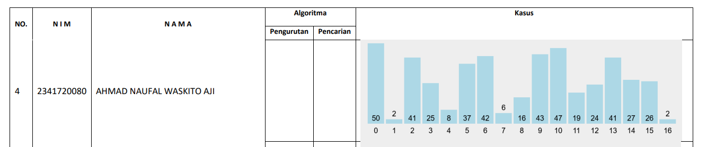
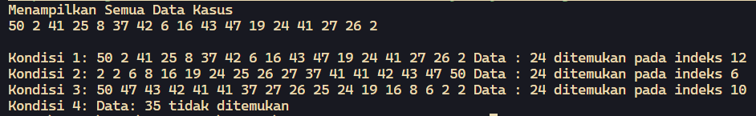

# <p align="center">Ujian Tengah Semester</p>

<br><br>

<p align="center">
    
</p>

<br><br>

<p align="center">
    Nama : Ahmad Naufal Waskito Aji <br>
    NIM : 2341720080 <br>
    Kelas : TI-1B <br>
    Prodi : D4 Teknik Informatika
</p>

***



### **Kode Program**
**Kasus04.java**
```java
public class Kasus04 {
    int nilai;

    public Kasus04(int n){
        this.nilai = n;
    }

    public void tampilDataKasus() {
        System.out.print(nilai + " ");
    }

}
```

**PencarianKasus04.java**
```java
public class PencarianKasus04 {
    Kasus04 listKs[] = new Kasus04[17];
    int idx;
    
    void tambah(Kasus04 m) {
        if (idx < listKs.length) {
            listKs[idx] = m;
            idx++;
        } else {
            System.out.println("Data sudah penuh!");
        }
    }

    void tampil() {
        for (Kasus04 m : listKs) {
            m.tampilDataKasus();
        }
    }

    public Kasus04 findKasus(int cari) {
        int posisi = -1;

        for (int i = 0; i < listKs.length; i++) {
            if (listKs[i].nilai == cari) {
                posisi = i;
                break;
            }
        }

        System.out.println();

        return listKs[posisi];
    }

    void tampilPosisi(int x, int pos){
        if(pos!=-1) {
            System.out.println("Data : " + x + " ditemukan pada indeks " + pos);
        } else {
            System.out.println("Data: " + x + " tidak ditemukan");
        }
    }

    void selectionSortAsc(){
        for(int i=0; i<listKs.length-1; i++){
            int idxMin = i;
            for(int j=i+1; j<listKs.length; j++){
                if(listKs[j].nilai < listKs[idxMin].nilai){
                    idxMin = j;
                }
            }

            Kasus04 tmp = listKs[idxMin];
            listKs[idxMin] = listKs[i];
            listKs[i] = tmp;
        }
    }
    
    void selectionSortDesc(){
        for(int i=0; i<listKs.length-1; i++){
            int idxMin = i;
            for(int j=i+1; j<listKs.length; j++){
                if(listKs[j].nilai > listKs[idxMin].nilai){
                    idxMin = j;
                }
            }

            Kasus04 tmp = listKs[idxMin];
            listKs[idxMin] = listKs[i];
            listKs[i] = tmp;
        }
    }

    public int FindBinarySearchAsc(int cari, int left, int right) {
        int mid;
        if (right >= left) {
            mid = left + (right - left) / 2;
            if (cari == listKs[mid].nilai) {
                return (mid);
            } else if (listKs[mid].nilai > cari) {
                return FindBinarySearchAsc(cari, left, mid - 1);
            } else {
                return FindBinarySearchAsc(cari, mid + 1, right);
            }
        }
        return -1;
    }

    public int FindBinarySearchDesc(int cari, int left, int right) {
        int mid;
        if (right >= left) {
            mid = left + (right - left) / 2;
            if (cari == listKs[mid].nilai) {
                return (mid);
            } else if (listKs[mid].nilai < cari) {
                return FindBinarySearchDesc(cari, left, mid - 1);
            } else {
                return FindBinarySearchDesc(cari, mid + 1, right);
            }
        }
        return -1;
    }
}
```

**KasusMain04.java**
```java
import java.util.Scanner;

public class KasusMain04 {
    public static void main(String[] args) {
        Scanner sc04 = new Scanner(System.in);
        int posisi;

        int[] arrayKasus = {50, 2, 41, 25, 8, 37, 42, 6, 16, 43, 47, 19, 24, 41, 27, 26, 2};

        PencarianKasus04 data = new PencarianKasus04();
        int jumKasus = arrayKasus.length;

        for (int i=0; i<jumKasus; i++) {
            Kasus04 m = new Kasus04(arrayKasus[i]);
            data.tambah(m);
        }

        System.out.println("Menampilkan Semua Data Kasus");
        data.tampil();

        System.out.println();

        posisi = data.FindBinarySearchAsc(24, 0, jumKasus - 1);
        Kasus04 dataKasus = data.findKasus(24);

        System.out.print("Kondisi 1: ");
        data.tampil();
        data.tampilPosisi(24, posisi);

        System.out.print("Kondisi 2: ");
        data.selectionSortAsc();
        data.tampil();

        posisi = data.FindBinarySearchAsc(24, 0, jumKasus - 1);
        data.tampilPosisi(24, posisi);

        System.out.print("Kondisi 3: ");
        data.selectionSortDesc();
        data.tampil();
        
        posisi = data.FindBinarySearchDesc(24, 0, jumKasus - 1);
        data.tampilPosisi(24, posisi);


        System.out.print("Kondisi 4: ");
        posisi = data.FindBinarySearchDesc(35, 0, jumKasus - 1);
        data.tampilPosisi(35, posisi);
    }
}
```

### **Hasil Percobaan**

